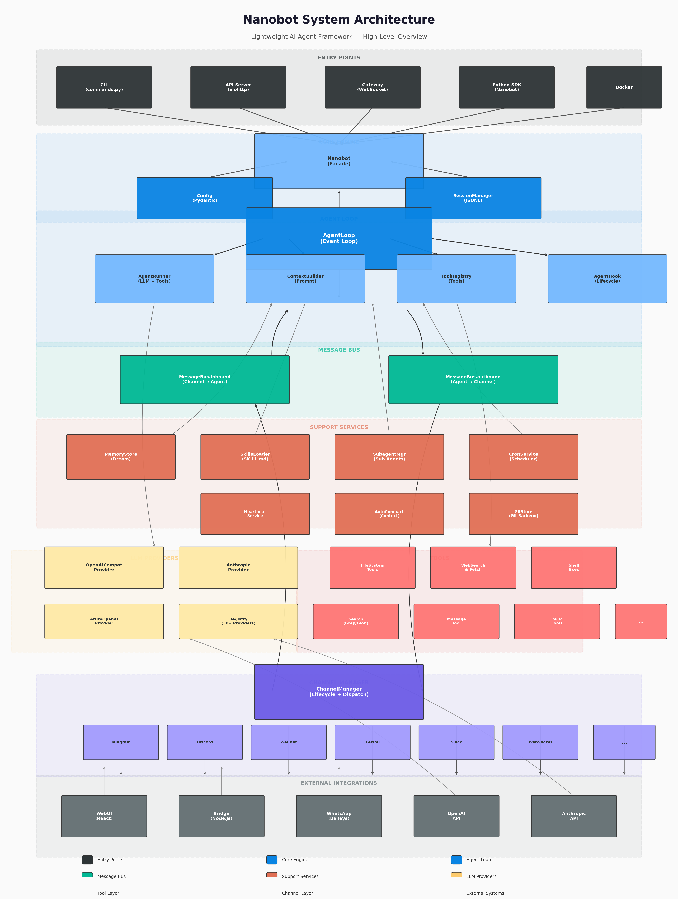

# 第1章：Agent 的概念与范式

> **学习目标**：理解 AI Agent 的本质，区分 Agent 与 Chatbot、RAG 的差异，掌握单 Agent 与多 Agent 两种架构范式，并能在 nanobot 项目中找到对应的设计映射。

---

## 1.1 引言：从"对话"到"行动"

2022 年底，ChatGPT 的横空出世让全世界第一次直观感受到了大语言模型（LLM）的能力。人们惊叹于它能写诗、写代码、翻译语言、回答各种问题。但很快，一个更本质的问题浮现出来：

> **如果 LLM 只能"说话"，它的价值是否被限制了？**

想象这样一个场景：你对 AI 说"帮我订一张明天去北京的机票"。一个纯粹的聊天机器人（Chatbot）可能会告诉你订机票的步骤、推荐几个购票网站，甚至帮你查询航班信息——但它**无法真正完成订票这个动作**。

而 **AI Agent**（智能体）则不同。它会：
1. **理解**你的需求（明天、北京、机票）
2. **规划**行动步骤（打开购票网站→查询航班→选择合适航班→填写信息→支付）
3. **调用工具**（浏览器、支付接口）执行每一步
4. **观察结果**（页面反馈、支付状态）
5. **调整策略**（如果航班售罄，自动查询其他时间）
6. **完成任务**并向你汇报结果

这就是 Agent 的核心魅力：**它不仅思考，还能行动**。

**nanobot** 正是一个典型的 AI Agent 框架。它的名字"nano"（纳米）体现了设计哲学——核心循环保持极简（`agent/loop.py` 约 1189 行，`agent/runner.py` 约 1013 行），但通过这个精简的"心脏"，它能驱动文件操作、网络搜索、Shell 命令执行、定时任务调度等丰富的现实世界交互。

---

## 1.2 什么是 AI Agent：感知-思考-行动循环

### 1.2.1 经典定义

AI Agent 的经典定义来自**感知-思考-行动模型**（Perception-Thinking-Action Model，简称 PTA 循环）：

```
┌─────────────┐     ┌─────────────┐     ┌─────────────┐
│  Perception │────→│   Thinking  │────→│   Action    │
│   (感知)     │     │   (思考)     │     │   (行动)     │
└─────────────┘     └─────────────┘     └─────────────┘
       ↑                                        │
       └──────────── Feedback (反馈) ────────────┘
```

**感知（Perception）**：接收来自外部世界的信息。在 nanobot 中，这对应 `MessageBus.inbound` 接收到的用户消息——可能来自 Telegram、Discord、微信、Slack 等 14+ 个平台。

**思考（Thinking）**：基于感知到的信息，结合已有知识和记忆，进行推理和决策。在 nanobot 中，这是 `AgentLoop` 的核心工作：构建 Prompt（`ContextBuilder`）、调用 LLM（`AgentRunner`）、解析 LLM 的回复来决定下一步行动。

**行动（Action）**：将思考的结果转化为对外部世界的实际操作。在 nanobot 中，这就是**工具调用**（Tool Calling）——`ToolRegistry` 中的 `read_file`、`exec`、`web_search` 等工具会被实际执行。

**反馈（Feedback）**：行动的结果会作为新的感知输入，形成闭环。在 nanobot 中，工具执行的结果会被追加到对话历史中，再次送入 LLM，LLM 据此决定是否需要进一步行动。

### 1.2.2 以 nanobot 为例理解 PTA 循环

让我们通过一个具体场景，看看 nanobot 是如何运转 PTA 循环的。

**场景**：用户在 Telegram 上对 nanobot 说："帮我查找项目里所有使用了 `asyncio.sleep` 的文件，然后告诉我它们的用途。"

**Step 1 — 感知（Perception）**

Telegram 通道（`channels/telegram.py`）监听到用户消息后，将其封装为 `InboundMessage`：

```python
# nanobot/bus/events.py 中的数据结构示意
@dataclass
class InboundMessage:
    channel: str = "telegram"           # 来自哪个平台
    sender_id: str = "user_123"         # 发送者ID
    chat_id: str = "chat_456"           # 聊天ID
    content: str = "帮我查找..."         # 消息内容
    media: list[str] = field(default_factory=list)  # 附件
    metadata: dict = field(default_factory=dict)    # 额外元数据
```

这条消息通过 `MessageBus.publish_inbound()` 被放入入队队列。

**Step 2 — 思考（Thinking）**

`AgentLoop`（`agent/loop.py`）从 `MessageBus.inbound` 中取出消息，开始思考：

1. **构建上下文**：`ContextBuilder.build_system_prompt()` 组装身份提示词 + `AGENTS.md` 等引导文件 + 记忆 + 技能描述 + 最近历史
2. **构建消息列表**：将用户消息包装为 LLM 能理解的格式
3. **调用 LLM**：`AgentRunner` 将完整的 Prompt 发送给配置的 LLM Provider

LLM 接收到请求后，分析用户的需求，决定需要调用 `grep` 工具来搜索代码：

```json
{
  "tool_calls": [
    {
      "id": "call_123",
      "type": "function",
      "function": {
        "name": "grep",
        "arguments": "{\"pattern\": \"asyncio.sleep\", \"output_mode\": \"files_with_matches\"}"
      }
    }
  ]
}
```

**Step 3 — 行动（Action）**

`AgentRunner` 解析 LLM 返回的 `tool_calls`，通过 `ToolRegistry` 找到 `grep` 工具并执行：

```python
# nanobot/agent/tools/search.py
grep_tool = tool_registry.get("grep")
result = await grep_tool.execute(pattern="asyncio.sleep", output_mode="files_with_matches")
# 返回: ["nanobot/agent/loop.py", "nanobot/cron/service.py", ...]
```

**Step 4 — 反馈（Feedback）**

工具执行结果作为"观察"（Observation）被追加到对话历史中：

```python
messages.append({
    "role": "tool",
    "tool_call_id": "call_123",
    "content": "nanobot/agent/loop.py\nnanobot/cron/service.py\n..."
})
```

然后 `AgentRunner` **再次调用 LLM**，将工具结果告诉它。LLM 分析这些文件后，可能决定调用 `read_file` 来读取部分文件内容，进一步了解 `asyncio.sleep` 的用途。这个"LLM 调用 → 工具执行 → 结果反馈 → 再次 LLM 调用"的循环会持续进行，直到 LLM 认为任务已完成，返回最终的自然语言回复。

**Step 5 — 响应输出**

最终的自然语言回复通过 `MessageBus.outbound` 进入出队队列，`ChannelManager` 将其路由回 Telegram 通道，用户看到：

> "我在以下文件中找到了 `asyncio.sleep` 的使用：
> 1. `nanobot/agent/loop.py` — 用于心跳检测间隔...
> 2. `nanobot/cron/service.py` — 用于定时任务的精度控制...
> ..."

这就是一次完整的 PTA 循环。nanobot 的代码设计完美映射了这个理论模型：

| PTA 阶段 | nanobot 组件 | 对应源码 |
|---------|------------|---------|
| 感知 | `MessageBus.inbound` + `BaseChannel` | `bus/queue.py`, `channels/` |
| 思考 | `AgentLoop` + `AgentRunner` + `ContextBuilder` | `agent/loop.py`, `agent/runner.py`, `agent/context.py` |
| 行动 | `ToolRegistry` + 具体 Tool 实现 | `agent/tools/registry.py`, `agent/tools/*.py` |
| 反馈 | 消息追加到 Session History | `session/manager.py` |

---

## 1.3 Agent vs Chatbot vs RAG：三种范式的区别

理解了 Agent 的基本循环后，有必要澄清一个常见的混淆：**Agent、Chatbot 和 RAG 到底有什么区别？**

这三者经常被混为一谈，因为它们都使用 LLM 作为"大脑"，但它们的能力边界和架构设计有本质不同。

### 1.3.1 核心对比

| 维度 | Chatbot（聊天机器人） | RAG（检索增强生成） | Agent（智能体） |
|------|---------------------|-------------------|----------------|
| **核心能力** | 对话、问答、内容生成 | 基于外部知识库的回答 | 感知 + 推理 + 工具调用 + 行动 |
| **与外部世界交互** | ❌ 无 | ⚠️ 只读（检索文档） | ✅ 读写（执行工具、修改状态） |
| **记忆** | 短期（上下文窗口） | 无（每次独立检索） | 短期 + 长期（持久化记忆） |
| **规划能力** | ❌ 无 | ❌ 无 | ✅ 多步骤任务分解与执行 |
| **自主性** | 被动响应 | 被动响应 | 主动规划、可自我调度 |
| **典型应用场景** | 客服问答、写作助手 | 企业知识库问答、文档助手 | 代码助手、自动化运维、研究助理 |

### 1.3.2 用 nanobot 说明三者差异

假设用户问 nanobot："我的服务器磁盘快满了，帮我清理一下。"

**如果 nanobot 只是一个 Chatbot**：
> "磁盘满了可能影响系统运行。你可以尝试以下步骤：1. 使用 `df -h` 查看磁盘使用情况；2. 使用 `du` 查找大文件；3. 清理日志文件..."
>
> ✅ 给出了有用的建议，但**没有真正执行任何操作**。

**如果 nanobot 只是一个 RAG 系统**：
> 它会从文档库中检索关于"磁盘清理"的相关文档，然后基于检索到的内容生成回答。
>
> ✅ 能引用组织的内部运维文档，但仍然**无法操作服务器**。

**作为 Agent 的 nanobot**（实际行为）：

1. 调用 `exec` 工具执行 `df -h`，**感知**到磁盘确实满了（使用率 95%）
2. 调用 `exec` 执行 `du -sh /var/log/*`，**发现**日志占用了 30GB
3. 调用 `exec` 执行 `find /var/log -name "*.log" -mtime +30 -delete`，**清理**旧日志
4. 再次调用 `df -h`，**验证**磁盘使用率下降到 70%
5. 向用户汇报："已清理 /var/log 下 30 天前的日志文件，释放了约 28GB 空间，当前磁盘使用率 70%。"

> ✅ **感知问题 → 分析原因 → 采取行动 → 验证结果 → 汇报进展** —— 这就是 Agent 的完整闭环。

### 1.3.3 并非对立，而是递进

值得注意的是，这三者并非互斥，而是**能力递进**的关系：

```
Chatbot ⊂ RAG ⊂ Agent
```

- **RAG = Chatbot + 外部知识检索**
- **Agent = RAG + 工具调用 + 规划 + 记忆 + 自主执行**

nanobot 同时具备这三种能力：
- 它有 `web_search` 和 `web_fetch` 工具，可以进行**检索**（RAG 能力）
- 它有丰富的对话上下文管理，支持**自然语言对话**（Chatbot 能力）
- 它有 14+ 种工具可以**主动执行操作**（Agent 核心能力）

---

## 1.4 Agent 的架构范式

### 1.4.1 单 Agent 架构（Single-Agent）

单 Agent 架构是最基础、最常见的模式：一个 Agent 独立处理所有任务。

```
┌─────────────────────────────────────────────┐
│              Single-Agent Architecture         │
├─────────────────────────────────────────────┤
│                                               │
│    User ──→ [Agent] ──→ Tools / APIs         │
│              ↑   ↓                            │
│           Memory / Knowledge                   │
│                                               │
└─────────────────────────────────────────────┘
```

下图展示了 nanobot 的系统架构全景：



**特点**：
- 一个 Agent 拥有完整的感知-思考-行动能力
- 所有工具直接挂载在这个 Agent 上
- 实现简单，易于调试和维护

**nanobot 的单 Agent 模式**：

nanobot 的默认运行模式就是单 Agent 架构。`AgentLoop` 是唯一的"大脑"，`ToolRegistry` 是它直接调用的"手脚"。当你通过 CLI 运行 `nanobot agent` 时，就是启动了一个单 Agent 实例：

```python
# nanobot/cli/commands.py 中的核心流程示意
async def run_agent():
    bot = Nanobot.from_config(config)
    # Nanobot 内部创建了一个 AgentLoop
    # AgentLoop 内部有一个 AgentRunner
    # AgentRunner 连接到一个 LLMProvider 和一个 ToolRegistry
    await bot.run()  # 启动单 Agent 事件循环
```

单 Agent 的优势在于**简洁**。nanobot 的核心设计哲学正是"小而美"——用不到 2500 行核心代码（`loop.py` + `runner.py`）支撑起完整的 Agent 能力。

### 1.4.2 多 Agent 架构（Multi-Agent）

当任务复杂度增加，单个 Agent 可能面临以下挑战：
- **工具爆炸**：挂载太多工具会让 LLM 的选择困难，降低决策质量
- **上下文膨胀**：不同任务的历史消息混杂在一起，干扰当前任务
- **职责不清**：一个 Agent 既要写代码又要查资料，容易"分心"

多 Agent 架构通过**任务分工**解决这些问题：

```
┌──────────────────────────────────────────────────────────────┐
│                 Multi-Agent Architecture                      │
├──────────────────────────────────────────────────────────────┤
│                                                               │
│    User ──→ [Orchestrator Agent]                             │
│                  │                                            │
│      ┌──────────┼──────────┐                                 │
│      ↓          ↓          ↓                                 │
│  [Coder Agent] [Search Agent] [Review Agent]                 │
│      │          │          │                                 │
│   File Tools  Web Tools   Analysis Tools                     │
│                                                               │
└──────────────────────────────────────────────────────────────┘
```

**特点**：
- **编排者（Orchestrator）**：接收用户请求，分解任务，分发给专门的 Agent
- **专业 Agent**：每个 Agent 只负责一个领域，挂载相关工具，拥有独立记忆
- **协作机制**：Agent 之间通过消息传递协作完成任务

**nanobot 的多 Agent 支持**：

nanobot 通过 `SubagentManager`（`agent/subagent.py`）支持多 Agent 模式。它的设计非常轻量：

```python
# 概念示意（基于 nanobot/agent/subagent.py 的设计）
class SubagentManager:
    """管理子 Agent 的生命周期和通信。"""

    async def spawn(self, task: str, tools: list[str] | None = None) -> str:
        """
        创建一个新的子 Agent 来执行特定任务。
        子 Agent 拥有独立的 Session、可选的工具子集，
        完成后将结果返回给父 Agent。
        """
        ...
```

例如，你可以配置一个"代码审查 Agent"子代理，它只挂载 `read_file`、`grep`、`exec`（运行测试）等工具，专门负责检查代码质量；同时另一个"文档 Agent"只挂载 `web_search`、`web_fetch` 工具，专门负责查找资料。

nanobot 的多 Agent 设计遵循**最小化原则**——不引入复杂的 Agent 通信协议或共享状态机制，而是通过简单的"委派-返回"模式实现协作。这种设计降低了系统的复杂度，也更容易理解和调试。

### 1.4.3 架构选型建议

| 场景 | 推荐架构 | nanobot 配置方式 |
|------|---------|-----------------|
| 个人助手、简单问答 | 单 Agent | 默认配置 |
| 代码开发（编码+测试+文档） | 单 Agent + 技能切换 | 使用 `skill-creator` 定义不同技能 |
| 复杂研究（搜索+分析+写作+审核） | 多 Agent | 使用 `SubagentManager.spawn()` |
| 24/7 自动化运维 | 单 Agent + Cron/Heartbeat | 配置 `cron` 和 `HEARTBEAT.md` |

nanobot 的设计允许你在单 Agent 和多 Agent 之间**灵活切换**，而不需要更换框架或重写核心逻辑。这是其架构设计的一个亮点。

---

## 1.5 本章小结

本章从概念层面建立了对 AI Agent 的完整认知框架：

1. **Agent 的本质**是**感知-思考-行动循环（PTA）**。它不仅能理解和生成语言，还能通过工具与现实世界交互，形成闭环反馈。

2. **Agent vs Chatbot vs RAG** 的关键差异在于**行动能力**：Chatbot 只能对话，RAG 只能检索，Agent 能真正执行操作。三者是能力递进关系，而非对立关系。

3. **单 Agent 架构**适合大多数场景，简洁高效；**多 Agent 架构**通过任务分工应对复杂场景，nanobot 通过 `SubagentManager` 以轻量方式支持这一模式。

4. **nanobot 是一个极佳的学习样本**——它用精简的代码完整实现了 Agent 的所有核心范式，同时保持了生产级的稳定性和扩展性。

---

## 1.6 动手实验

### 实验 1：体验 nanobot 的 Agent 能力

1. 安装 nanobot：`pip install nanobot`
2. 运行配置向导：`nanobot onboard`
3. 在 CLI 中测试以下指令，观察它的行为：
   - `"你好，请介绍一下自己"`（Chatbot 模式——纯对话）
   - `"搜索一下 Python asyncio 的最佳实践"`（RAG 模式——检索+总结）
   - `"读取当前目录下的 README.md，告诉我项目的主要功能"`（Agent 模式——工具调用+分析）
   - `"执行 ls -la 命令，告诉我最大的三个文件"`（Agent 模式——工具调用+推理）

### 实验 2：对比不同"模式"的行为差异

尝试向 nanobot 提问：`"帮我总结这个网页的内容：https://docs.python.org/3/library/asyncio.html"`

观察 nanobot 的响应过程：
- 它调用了哪些工具？（查看日志输出）
- 它执行了几个步骤才给出最终答案？
- 如果让普通 Chatbot 回答同样的问题，结果会有什么不同？

### 实验 3：识别 nanobot 中的 PTA 循环

阅读 `nanobot/agent/loop.py` 的前 200 行代码，尝试找到以下对应的代码位置：
- **感知**：消息是从哪里进入 AgentLoop 的？（提示：搜索 `consume_inbound`）
- **思考**：LLM 是在哪里被调用的？（提示：搜索 `runner.run`）
- **行动**：工具调用结果是如何被处理的？（提示：搜索 `tool_calls`）
- **反馈**：对话历史是如何被保存的？（提示：搜索 `session_manager`）

---

## 1.7 思考题

1. 为什么 Agent 需要"反馈"环节？如果去掉反馈循环，只执行一次工具调用就结束，会发生什么？

2. 单 Agent 架构中，如果挂载了 50 个工具，LLM 的决策质量可能会下降。你能想到什么解决方案？（提示：考虑 nanobot 的 Skills 系统和 Subagent 设计）

3. nanobot 的 `MessageBus` 使用 `asyncio.Queue` 实现。如果不使用消息总线，直接让通道调用 AgentLoop 的方法，会有什么问题？

4. 在 nanobot 的架构图中，`ChannelManager` 和 `MessageBus` 之间是双向箭头。为什么出队消息（Outbound）也需要经过 ChannelManager，而不是直接由通道发送？

---

## 参考阅读

- nanobot 源码：`nanobot/agent/loop.py`（第 1-200 行，主事件循环入口）
- nanobot 源码：`nanobot/bus/queue.py`（MessageBus 完整实现，仅 44 行）
- nanobot 文档：`docs/README.md`（项目概述）
- 论文：*ReAct: Synergizing Reasoning and Acting in Language Models*（Yao et al., 2022）—— Agent 中推理与行动结合的经典工作

---

> **下一章预告**：第2章《Agent 的核心能力模型》将深入剖析 Agent 必须具备的四大能力——工具使用、记忆、规划、自我反思，并以 nanobot 的能力矩阵为例，展示这些能力在代码中的具体实现。
