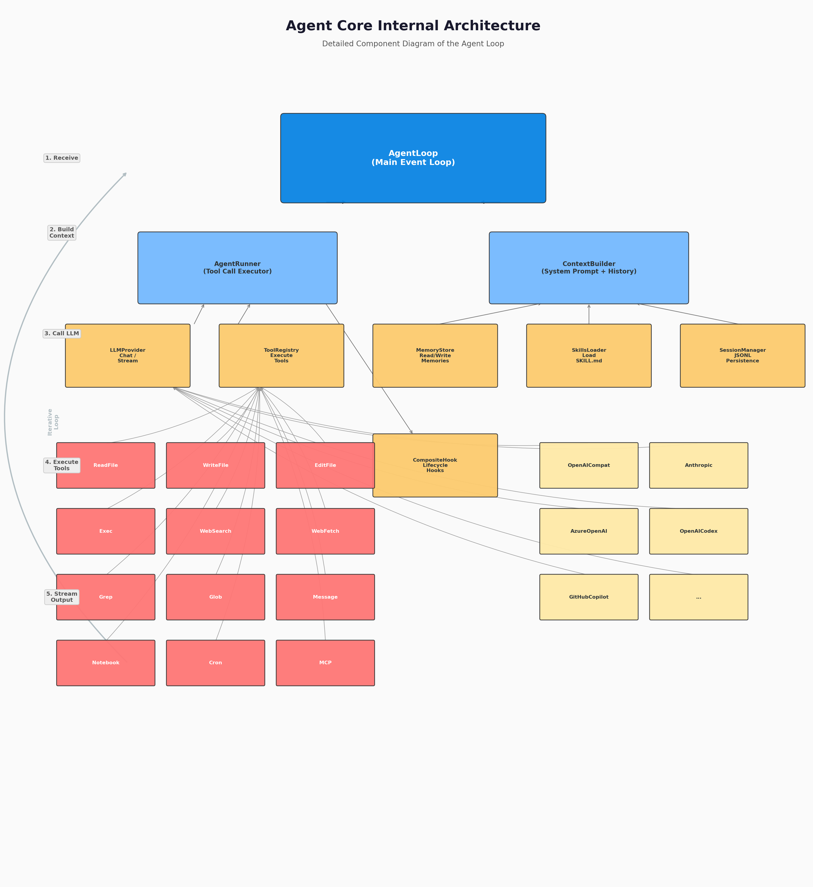

# 第2章：Agent 的核心能力模型

> **学习目标**：掌握 Agent 必须具备的四大核心能力——工具使用、记忆、规划、自我反思，理解每种能力的设计原理，并能在 nanobot 源码中找到对应的实现机制。

---

## 2.1 引言：Agent 的"能力拼图"

在第1章中，我们建立了 Agent 的基本认知：**Agent 是能够通过感知-思考-行动循环（PTA）与现实世界交互的 AI 系统**。但"交互"只是一个笼统的说法，一个真正有生产力的 Agent 需要具备哪些具体能力呢？

学术界和工业界对此有不同的归纳方式，但最广为接受的框架将 Agent 的核心能力归纳为**四大支柱**：

```
┌─────────────────────────────────────────────────────────────┐
│                    Agent Core Capabilities                   │
├─────────────┬─────────────┬─────────────┬───────────────────┤
│  Tool Use   │   Memory    │  Planning   │ Self-Reflection   │
│  (工具使用)  │   (记忆)    │   (规划)    │   (自我反思)       │
├─────────────┼─────────────┼─────────────┼───────────────────┤
│ 让 Agent    │ 让 Agent    │ 让 Agent    │ 让 Agent          │
│ 拥有"手脚"   │ 拥有"记忆"   │ 拥有"策略"   │ 拥有"自省"        │
│             │             │             │                   │
│ read_file   │ 对话历史     │ 任务分解     │ 错误恢复           │
│ exec        │ 长期记忆     │ 迭代执行     │ 结果评估           │
│ web_search  │ 技能知识     │ 子 Agent    │ 策略调整           │
└─────────────┴─────────────┴─────────────┴───────────────────┘
```

下图展示了 nanobot 的 Agent 核心架构，四大能力在代码中的映射关系：



这四种能力缺一不可：
- **没有工具使用** = Chatbot，只能纸上谈兵
- **没有记忆** = 金鱼，每次对话都从零开始
- **没有规划** = 莽夫，无法处理多步骤复杂任务
- **没有自我反思** = 固执己见，犯错后无法纠正

**nanobot 的设计精妙之处在于**：它用极精简的代码实现了这四种能力的完整闭环。`agent/` 目录下的约 4000 行核心代码（不含工具实现）支撑起了整个能力体系。本章将以这四大能力为线索，逐层拆解 nanobot 的设计智慧。

---

## 2.2 能力一：工具使用（Tool Use）—— Agent 的"手脚"

> **工具使用是 Agent 区别于 Chatbot 的最本质特征。**

### 2.2.1 从"说话"到"动手"：工具使用的意义

想象一个场景：你问 Agent "我项目里的 main.py 是做什么的？"

**没有工具**的 LLM 只能回答："根据常见命名惯例，main.py 通常是项目的入口文件..."——它在**猜测**，因为它无法真正读取你的文件。

**有工具**的 Agent 会：
1. 调用 `read_file(path="main.py")` 读取文件内容
2. 分析代码逻辑
3. 给出准确回答："你的 main.py 使用了 FastAPI，定义了三个路由..."

这就是工具使用的威力：**它让 LLM 从"闭门造车"变为"实事求是"**。

### 2.2.2 OpenAI Function Calling 协议

现代 LLM（OpenAI GPT 系列、Claude、Gemini 等）普遍支持 **Function Calling**（函数调用）机制。其核心协议非常简单：

**第一步**：调用方告诉 LLM 有哪些工具可用

```json
{
  "tools": [
    {
      "type": "function",
      "function": {
        "name": "read_file",
        "description": "Read the contents of a file",
        "parameters": {
          "type": "object",
          "properties": {
            "path": {"type": "string", "description": "File path"}
          },
          "required": ["path"]
        }
      }
    }
  ]
}
```

**第二步**：LLM 决定是否需要调用工具

如果用户问"读取 main.py"，LLM 返回：

```json
{
  "content": null,
  "tool_calls": [
    {
      "id": "call_abc123",
      "type": "function",
      "function": {
        "name": "read_file",
        "arguments": "{\"path\": \"main.py\"}"
      }
    }
  ]
}
```

**第三步**：调用方执行工具，将结果反馈给 LLM

```json
{"role": "tool", "tool_call_id": "call_abc123", "content": "import fastapi..."}
```

**第四步**：LLM 基于工具结果给出最终回复

> "你的 main.py 使用了 FastAPI 框架，定义了..."

这个协议的美妙之处在于：**LLM 不需要知道工具的具体实现**，它只需要理解工具的"接口契约"（名称、描述、参数）。工具的具体执行由 Agent 框架负责。

### 2.2.3 nanobot 的 Tool 抽象基类

nanobot 将 Function Calling 协议封装成了一个优雅的抽象基类——`Tool`（`agent/tools/base.py`，279 行）。让我们看看它的设计：

```python
# nanobot/agent/tools/base.py (精简示意)
class Tool(ABC):
    """Agent capability: read files, run commands, etc."""

    @property
    @abstractmethod
    def name(self) -> str:
        """Tool name used in function calls."""        # 如 "read_file"

    @property
    @abstractmethod
    def description(self) -> str:
        """Description of what the tool does."""        # LLM 通过描述理解工具用途

    @property
    @abstractmethod
    def parameters(self) -> dict[str, Any]:
        """JSON Schema for tool parameters."""            # 参数契约

    @abstractmethod
    async def execute(self, **kwargs: Any) -> Any:
        """Run the tool; returns a string or list of content blocks."""
        ...                                              # 实际执行逻辑
```

**设计亮点分析**：

1. **`name` + `description` + `parameters`** 三者构成完整的"接口契约"，直接映射到 OpenAI Function Calling 的 Schema 格式。

2. **`to_schema()` 方法** 自动生成标准的 OpenAI function schema：

```python
def to_schema(self) -> dict[str, Any]:
    return {
        "type": "function",
        "function": {
            "name": self.name,
            "description": self.description,
            "parameters": self.parameters,
        },
    }
```

3. **`@tool_parameters` 装饰器** 简化了参数定义。开发者不需要手写 `parameters` property，只需用装饰器挂载 JSON Schema：

```python
@tool_parameters({
    "type": "object",
    "properties": {
        "path": {"type": "string", "description": "File path to read"},
    },
    "required": ["path"],
})
class ReadFileTool(Tool):
    @property
    def name(self) -> str:
        return "read_file"

    @property
    def description(self) -> str:
        return "Read the contents of a file."

    async def execute(self, *, path: str, **kwargs) -> str:
        # 实际读取文件的逻辑
        ...
```

4. **参数类型安全**：`cast_params()` 和 `validate_params()` 提供了 Schema 驱动的类型转换和验证。LLM 有时会返回字符串形式的数字（如 `"42"`），`cast_params()` 会自动将其转为整数 `42`。

5. **并发安全标记**：`read_only` 和 `concurrency_safe` 属性允许框架判断哪些工具可以并行执行。例如 `read_file` 是只读的，可以和其他只读工具并行；而 `write_file` 是写操作，需要串行执行。

### 2.2.4 ToolRegistry：工具的统一管理

当 Agent 拥有十几个甚至几十个工具时，需要一个**注册表**来统一管理。nanobot 的 `ToolRegistry`（`agent/tools/registry.py`，125 行）是一个极简但功能完整的设计：

```python
# nanobot/agent/tools/registry.py (精简示意)
class ToolRegistry:
    def __init__(self):
        self._tools: dict[str, Tool] = {}
        self._cached_definitions: list[dict] | None = None

    def register(self, tool: Tool) -> None:
        self._tools[tool.name] = tool

    def get(self, name: str) -> Tool | None:
        return self._tools.get(name)

    def get_definitions(self) -> list[dict]:
        # 缓存工具定义列表，按内置工具 → MCP 工具排序
        ...

    async def execute(self, name: str, params: dict) -> Any:
        """完整的调用链路：解析 → 类型转换 → 验证 → 执行 → 错误处理"""
        tool, params, error = self.prepare_call(name, params)
        if error:
            return error + "\n\n[Analyze the error above and try a different approach.]"
        return await tool.execute(**params)
```

**注册表模式的价值**：

- **解耦**：LLM 只知道工具名称和 Schema，不关心实现细节
- **扩展性**：新增工具只需 `register()` 一行代码
- **动态性**：可以在运行时挂载/卸载工具（如 MCP 工具的动态加载）
- **缓存**：`get_definitions()` 缓存工具定义列表，避免重复生成

### 2.2.5 nanobot 的内置工具矩阵

nanobot 内置了 14+ 个工具，覆盖了 Agent 常见的工作场景：

| 工具类别 | 工具名称 | 功能 | 对应源码 |
|---------|---------|------|---------|
| **文件系统** | `read_file` | 读取文件内容 | `tools/filesystem.py` |
| | `write_file` | 写入/创建文件 | `tools/filesystem.py` |
| | `edit_file` | 编辑文件（搜索替换） | `tools/filesystem.py` |
| | `list_dir` | 列出目录内容 | `tools/filesystem.py` |
| **代码搜索** | `grep` | 代码文本搜索 | `tools/search.py` |
| | `glob` | 文件路径匹配 | `tools/search.py` |
| **Shell** | `exec` | 执行 Shell 命令 | `tools/shell.py` |
| **网络** | `web_search` | 网页搜索 | `tools/web.py` |
| | `web_fetch` | 抓取网页内容 | `tools/web.py` |
| **通信** | `message` | 发送消息（跨通道） | `tools/message.py` |
| **笔记** | `notebook` | 笔记本编辑 | `tools/notebook.py` |
| **定时** | `cron` | 定时任务管理 | `tools/cron.py` |
| **自我** | `my` | 自我检查工具 | `tools/self.py` |
| **进程** | `spawn` | 生成子进程 | `tools/spawn.py` |
| **MCP** | `mcp_*` | MCP 协议工具代理 | `tools/mcp.py` |

**设计哲学**：nanobot 的工具设计遵循**"最小可用集"原则**。它不提供成百上千的工具，而是提供一组最基础、最通用的原子操作。复杂的任务可以通过组合这些原子操作来完成。例如，"部署一个网站"不需要专门的"deploy"工具，而是组合 `write_file` + `exec` + `web_fetch` 即可实现。

---

## 2.3 能力二：记忆（Memory）—— Agent 的"经验"

> **记忆让 Agent 从"状态机"变为"有历史的生命体"。**

### 2.3.1 为什么需要记忆？

假设你和 Agent 正在进行一个多轮对话：

**Round 1**
- 你："帮我写一个 Python 函数，计算斐波那契数列"
- Agent：写了 `fib(n)` 函数

**Round 2**
- 你："再给它加上缓存"
- Agent：？？？（如果不记得上一轮的内容，它不知道"它"指的是什么）

**Round 3**
- 你："把刚才的代码保存到 fib.py"
- Agent：？？？（完全不记得写过什么代码）

没有记忆的 Agent 就像一个**没有短期记忆的人**——每句话都是独立的，无法进行连贯的多轮协作。

### 2.3.2 记忆的分类

Agent 的记忆通常分为三个层次：

```
┌─────────────────────────────────────────────────────────────┐
│                      Memory Hierarchy                        │
├─────────────────────────────────────────────────────────────┤
│                                                             │
│  Layer 3: Long-term Memory (长期记忆)                        │
│  ├─ 用户偏好、项目知识、历史经验                              │
│  ├─ 存储: 文件/数据库/向量存储                               │
│  └─ 生命周期: 跨会话持久                                     │
│                                                             │
│  Layer 2: Working Memory (工作记忆 / 会话记忆)                │
│  ├─ 当前对话的完整历史                                      │
│  ├─ 存储: 内存中的消息列表                                   │
│  └─ 生命周期: 当前会话                                      │
│                                                             │
│  Layer 1: Context Window (上下文窗口)                        │
│  ├─ 当前送入 LLM 的 Prompt + 最近几条消息                    │
│  ├─ 存储: LLM API 的请求体                                   │
│  └─ 生命周期: 单次 LLM 调用                                  │
│                                                             │
└─────────────────────────────────────────────────────────────┘
```

| 记忆层次 | 容量 | 持久性 | 在 nanobot 中的实现 |
|---------|------|--------|-------------------|
| 上下文窗口 | 4K~200K tokens | 极短（单次调用） | `messages` 列表 |
| 工作记忆 | 无上限（理论上） | 会话级 | `SessionManager` (JSONL) |
| 长期记忆 | 无上限 | 永久 | `MemoryStore` (文件) + `Dream` |

### 2.3.3 nanobot 的工作记忆：SessionManager

nanobot 的 `SessionManager` 将会话历史持久化为 **JSONL**（JSON Lines）格式：

```
~/.nanobot/workspace/sessions/
├── telegram:user_123:chat_456.jsonl   # Telegram 私聊会话
├── discord:guild_789:thread_abc.jsonl # Discord 线程会话
└── unified:default.jsonl              # 统一会话（跨平台共享）
```

每条消息占一行：

```jsonl
{"role": "user", "content": "帮我写个斐波那契函数"}
{"role": "assistant", "content": "```python\ndef fib(n):...\n```"}
{"role": "user", "content": "再给它加上缓存"}
{"role": "assistant", "content": "```python\nfrom functools import lru_cache\n\n@lru_cache(maxsize=None)\ndef fib(n):...\n```"}
{"role": "tool", "tool_call_id": "call_123", "content": "File written to fib.py"}
```

**JSONL 的优势**：
- **追加写友好**：新消息只需追加到文件末尾，无需重写整个文件
- **容错性强**：即使文件损坏，前面的记录仍然可读
- **便于流式处理**：可以逐行读取，无需一次性加载整个文件

### 2.3.4 nanobot 的长期记忆：MemoryStore + Dream

长期记忆是 nanobot 最具设计巧思的部分，它由两部分组成：

#### MemoryStore：纯文件 I/O 层

`MemoryStore`（`agent/memory.py`，963 行）是一个极简的文件操作封装：

```python
# nanobot/agent/memory.py (精简示意)
class MemoryStore:
    """Pure file I/O for memory files."""

    def __init__(self, workspace: Path):
        self.memory_dir = workspace / "memory"
        self.memory_file = self.memory_dir / "MEMORY.md"      # 长期记忆文本
        self.history_file = self.memory_dir / "history.jsonl" # 完整历史记录
        self.soul_file = workspace / "SOUL.md"                # Agent 身份/性格
        self.user_file = workspace / "USER.md"                # 用户画像
```

**关键文件说明**：

| 文件 | 作用 | 示例内容 |
|------|------|---------|
| `MEMORY.md` | 人工维护的长期记忆 | "用户喜欢 Python 风格指南" |
| `SOUL.md` | Agent 的自我认知 | "我是一个编程助手，擅长 Python" |
| `USER.md` | 用户画像 | "用户是后端工程师，偏好简洁代码" |
| `history.jsonl` | 自动记录的全部历史 | 每轮对话的完整记录 |

#### Dream：两阶段记忆整合

仅仅记录历史是不够的——随着对话量增加，历史文件会膨胀到 LLM 无法处理的程度。nanobot 的解决方案是 **Dream**（梦境）：一个两阶段的记忆整合器。

**Phase 1 — 触发**：当历史记录达到一定阈值，或者 Agent 空闲时，Dream 被唤醒。

**Phase 2 — 整合**：Dream 读取近期历史，使用 LLM 将其提炼为结构化摘要：

```
原始历史（100 条消息）
    ↓
Dream 调用 LLM："请将以下对话历史总结为关键信息点"
    ↓
提炼结果：
- 用户在开发一个 FastAPI 项目
- 用户偏好使用 Pydantic 进行数据验证
- 用户要求在代码中添加类型注解
    ↓
追加到 MEMORY.md
```

**设计亮点**：
- **不删除原始历史**：原始 `history.jsonl` 保留，摘要只是补充
- **用户可控**：`MEMORY.md` 是 Markdown 文件，用户可以直接编辑
- **Git 版本控制**：MemoryStore 集成了 `GitStore`，所有记忆文件的变更都被 Git 跟踪，可以回溯和恢复

### 2.3.5 记忆与上下文的平衡艺术

记忆系统面临一个核心矛盾：**记忆越多越好，但 LLM 的上下文窗口有限**。

nanobot 采用了多层策略来解决这个问题：

1. **最近历史优先**：`ContextBuilder._MAX_RECENT_HISTORY = 50`，优先加载最近 50 条历史
2. **长度硬限制**：`_MAX_HISTORY_CHARS = 32_000`，超过则截断
3. **自动压缩（AutoCompact）**：当上下文接近 Token 上限时，自动压缩可压缩的工具结果（如 `read_file`、`exec` 的输出）
4. **长期记忆按需加载**：`MEMORY.md` 的内容在每次构建 System Prompt 时自动注入，不占用上下文窗口的"消息"额度

---

## 2.4 能力三：规划（Planning）—— Agent 的"策略"

> **规划让 Agent 从"单步反应"进化为"多步推理"。**

### 2.4.1 隐式规划 vs 显式规划

Agent 的规划能力有两种实现方式：

**显式规划（Explicit Planning）**：Agent 在执行前先输出一个明确的计划，然后按步骤执行。

```
用户：帮我分析这个项目的代码质量

Agent [思考]：
1. 先读取项目结构（list_dir）
2. 找到主要的 Python 文件（glob）
3. 读取关键文件（read_file）
4. 运行 lint 工具检查（exec: pylint）
5. 生成质量报告

Agent [执行步骤1]: list_dir → ...
Agent [执行步骤2]: glob → ...
...
```

**隐式规划（Implicit Planning）**：Agent 不输出明确的计划，而是在每次 LLM 调用中隐式决定下一步行动。

```
用户：帮我分析这个项目的代码质量

Agent [LLM调用1]: 我需要先了解项目结构 → list_dir
Agent [LLM调用2]: 找到了 src/ 目录，需要查看 Python 文件 → glob
Agent [LLM调用3]: 看到了 main.py，让我读取它 → read_file
...
```

### 2.4.2 nanobot 的隐式规划：迭代执行模式

nanobot 采用的是**隐式规划**。它的核心机制是 `AgentRunner` 中的**迭代循环**（`agent/runner.py`）：

```python
# nanobot/agent/runner.py (概念示意)
class AgentRunner:
    async def run(self, spec: AgentRunSpec) -> AgentRunResult:
        messages = spec.initial_messages

        for iteration in range(1, spec.max_iterations + 1):
            # 1. 调用 LLM
            response = await self.provider.chat(messages, tools=spec.tools)

            # 2. 检查 LLM 的回复
            if response.has_tool_calls and response.should_execute_tools:
                # LLM 要求调用工具 → 执行工具，将结果加入消息，继续循环
                tool_results = await self._execute_tools(response.tool_calls, spec)
                messages.extend(self._build_tool_result_messages(tool_results))
                continue  # ← 隐式规划的关键：不预设计划，让 LLM 决定下一步
            else:
                # LLM 给出最终回复 → 结束循环
                return AgentRunResult(final_content=response.content, messages=messages)

        # 达到最大迭代次数，强制结束
        return AgentRunResult(stop_reason="max_iterations")
```

**隐式规划的精髓**：LLM 在每次调用后都会看到最新的工具结果，然后**自主决定**下一步该做什么。这种设计的优势：

1. **灵活性**：不需要预先定义所有可能的执行路径
2. **适应性**：如果某一步失败，LLM 可以在下一步调整策略
3. **简洁性**：不需要额外的规划模块，利用 LLM 自身的推理能力

### 2.4.3 迭代控制：max_iterations 与安全边界

隐式规划虽然灵活，但也存在风险：LLM 可能陷入无限循环（反复调用同一个工具）。nanobot 通过多层安全边界来控制：

```python
# nanobot/agent/runner.py 中的安全常量
_MAX_EMPTY_RETRIES = 2          # 空响应最大重试次数
_MAX_LENGTH_RECOVERIES = 3      # 长度超限最大恢复次数
_MAX_INJECTIONS_PER_TURN = 3    # 单轮消息注入最大次数
_MAX_INJECTION_CYCLES = 5       # 注入循环最大次数
```

`AgentRunSpec.max_iterations` 是最外层的安全网——无论 LLM 想执行多少步，达到上限后强制终止。

### 2.4.4 显式规划的支持：Subagent 的任务分解

对于需要明确分工的复杂任务，nanobot 通过 `SubagentManager` 支持**显式任务分解**：

```python
# nanobot/agent/subagent.py (概念示意)
class SubagentManager:
    async def spawn(self, task: str, tools: list[str] | None = None) -> str:
        """
        创建子 Agent 执行特定任务。
        子 Agent 拥有独立的 Session 和工具子集。
        """
        # 1. 创建独立的 ToolRegistry（只包含指定工具）
        child_registry = ToolRegistry()
        for tool_name in (tools or self.default_tools):
            child_registry.register(self.get_tool(tool_name))

        # 2. 创建独立的 AgentRunner
        child_runner = AgentRunner(self.provider)

        # 3. 运行子任务
        result = await child_runner.run(AgentRunSpec(
            initial_messages=[{"role": "user", "content": task}],
            tools=child_registry,
            max_iterations=...
        ))

        return result.final_content
```

**典型使用场景**：

```
用户：帮我研究 Python 的 asyncio，然后写一个教程

主 Agent [规划]：
├─ 子 Agent 1 [研究]：搜索 asyncio 文档、读取教程、收集最佳实践
│  └─ 工具: web_search, web_fetch, read_file
├─ 子 Agent 2 [写作]：基于研究结果撰写教程
│  └─ 工具: write_file, read_file
└─ 主 Agent [整合]：审核教程质量，输出最终版本
```

---

## 2.5 能力四：自我反思（Self-Reflection）—— Agent 的"自省"

> **自我反思让 Agent 从"执行者"进化为"学习者"。**

### 2.5.1 为什么需要自我反思？

Agent 在执行过程中不可避免地会犯错：
- 工具调用参数错误（文件路径不存在）
- LLM 产生幻觉（调用了不存在的工具）
- 执行结果不符合预期（Shell 命令返回错误码）
- 陷入循环（反复尝试相同的失败操作）

没有自我反思能力的 Agent 会**盲目执行**，直到耗尽迭代次数。有自我反思能力的 Agent 会：**识别错误 → 分析原因 → 调整策略 → 重试**。

### 2.5.2 错误恢复机制

nanobot 的 `AgentRunner` 内置了多层错误恢复机制（`agent/runner.py`）：

**Level 1 — 参数错误**：ToolRegistry 在执行前会进行参数验证

```python
# nanobot/agent/tools/registry.py
def prepare_call(self, name: str, params: dict):
    tool = self._tools.get(name)
    if not tool:
        return None, params, f"Error: Tool '{name}' not found..."

    cast_params = tool.cast_params(params)    # 类型转换
    errors = tool.validate_params(cast_params) # Schema 验证
    if errors:
        return tool, cast_params, f"Error: Invalid parameters: ..."
```

如果参数错误，工具不会执行，而是返回错误信息。LLM 看到这个错误后，会修正参数再次尝试。

**Level 2 — 执行异常**：工具执行过程中抛出的异常被捕获

```python
# nanobot/agent/tools/registry.py
async def execute(self, name: str, params: dict):
    try:
        result = await tool.execute(**params)
        if isinstance(result, str) and result.startswith("Error"):
            return result + "\n\n[Analyze the error above and try a different approach.]"
        return result
    except Exception as e:
        return f"Error executing {name}: {str(e)}\n\n[Analyze the error above and try a different approach.]"
```

注意错误消息末尾的提示：`[Analyze the error above and try a different approach.]`——这是引导 LLM 进行自我反思的关键提示词。

**Level 3 — 空响应恢复**：LLM 返回空内容时自动重试

```python
# nanobot/agent/runner.py
_MAX_EMPTY_RETRIES = 2

# 如果 LLM 返回空响应，注入恢复消息，重试最多 2 次
```

**Level 4 — 长度超限恢复**：工具结果或上下文超过长度限制时自动压缩

```python
# nanobot/agent/runner.py
_MAX_LENGTH_RECOVERIES = 3

# 如果上下文超过 token 限制，自动截断可压缩的工具结果
```

### 2.5.3 AgentHook：生命周期钩子系统

nanobot 通过 `AgentHook`（`agent/hook.py`，103 行）提供了**观察者模式**的生命周期钩子：

```python
# nanobot/agent/hook.py
class AgentHook:
    """Minimal lifecycle surface for shared runner customization."""

    async def before_iteration(self, context: AgentHookContext) -> None:
        """每次 LLM 调用前触发"""

    async def on_stream(self, context: AgentHookContext, delta: str) -> None:
        """流式输出时每收到一个 token 触发"""

    async def before_execute_tools(self, context: AgentHookContext) -> None:
        """执行工具前触发"""

    async def after_iteration(self, context: AgentHookContext) -> None:
        """每次迭代结束后触发"""

    def finalize_content(self, context: AgentHookContext, content: str | None) -> str | None:
        """最终内容生成后触发，可修改内容"""
```

**`AgentHookContext`** 携带了每次迭代的完整状态：

```python
@dataclass
class AgentHookContext:
    iteration: int                # 当前迭代次数
    messages: list[dict]          # 当前消息列表
    response: LLMResponse | None  # LLM 的回复
    tool_calls: list[ToolCallRequest]   # 本次的工具调用请求
    tool_results: list            # 工具执行结果
    usage: dict                   # Token 用量
    stop_reason: str | None       # 停止原因
    error: str | None             # 错误信息
```

**内建的 `_LoopHook`** 利用这些钩子实现了流式输出、进度回调、迭代计数等功能。

**`CompositeHook`** 支持多个钩子的组合：

```python
class CompositeHook(AgentHook):
    """Fan-out hook that delegates to an ordered list of hooks.
    Error isolation: a faulty custom hook cannot crash the agent loop.
    """
```

这体现了**防御性设计**：即使自定义钩子出错，也不会影响 Agent 的核心循环。

### 2.5.4 Heartbeat：主动自我检查

nanobot 的 `HeartbeatService`（`heartbeat/service.py`）是一种**主动式自我反思**：

**Phase 1 — 决策**：定期唤醒，检查 `HEARTBEAT.md` 中的待办任务列表，由 LLM 决定是否需要执行

**Phase 2 — 执行**：如果需要执行，启动 Agent 处理任务，完成后评估是否需要通知用户

这相当于给 Agent 安装了一个"闹钟"，让它能够自主检查工作进度，而不是完全被动地等待用户指令。

---

## 2.6 nanobot 能力矩阵总览

将四大能力映射到 nanobot 的具体组件：

```
┌──────────────────┬────────────────────────────────────────────────────┐
│    核心能力      │                    nanobot 实现                      │
├──────────────────┼────────────────────────────────────────────────────┤
│                  │ • Tool 抽象基类 (agent/tools/base.py)               │
│   工具使用        │ • ToolRegistry 注册表 (agent/tools/registry.py)     │
│                  │ • 14+ 内置工具 (agent/tools/*.py)                   │
│                  │ • MCP 动态工具代理 (agent/tools/mcp.py)             │
├──────────────────┼────────────────────────────────────────────────────┤
│                  │ • SessionManager (session/manager.py)               │
│     记忆         │ • MemoryStore 文件 I/O (agent/memory.py)            │
│                  │ • Dream 两阶段整合 (agent/memory.py)                │
│                  │ • GitStore 版本控制 (utils/gitstore.py)             │
├──────────────────┼────────────────────────────────────────────────────┤
│                  │ • AgentRunner 迭代循环 (agent/runner.py)            │
│     规划         │ • max_iterations 安全边界                           │
│                  │ • SubagentManager 任务分解 (agent/subagent.py)      │
│                  │ • AutoCompact 上下文管理 (agent/autocompact.py)     │
├──────────────────┼────────────────────────────────────────────────────┤
│                  │ • 多层错误恢复 (agent/runner.py)                     │
│   自我反思        │ • AgentHook 生命周期钩子 (agent/hook.py)            │
│                  │ • HeartbeatService (heartbeat/service.py)           │
│                  │ • 错误提示引导 LLM 修正 (registry.py 中的 _HINT)     │
└──────────────────┴────────────────────────────────────────────────────┘
```

**值得注意的设计原则**：

1. **单一职责**：每个组件只做一件事。`Tool` 负责执行，`MemoryStore` 负责文件 I/O，`AgentHook` 负责事件通知
2. **可组合性**：`CompositeHook` 可以组合多个钩子，`ToolRegistry` 可以动态增删工具
3. **防御性编程**：错误隔离、重试机制、安全边界无处不在
4. **最小化设计**：没有引入复杂的规划算法或记忆网络，而是充分利用 LLM 的推理能力，通过精巧的 Prompt 设计和迭代控制实现复杂行为

---

## 2.7 本章小结

本章深入剖析了 Agent 的四大核心能力及其在 nanobot 中的实现：

1. **工具使用（Tool Use）**：通过 `Tool` 抽象基类和 `ToolRegistry` 注册表，nanobot 实现了与 OpenAI Function Calling 协议的无缝对接。`@tool_parameters` 装饰器简化了工具开发，并发安全标记支持了智能的并行执行。

2. **记忆（Memory）**：三层记忆架构（上下文窗口→工作记忆→长期记忆）各有其存储策略。`SessionManager` 使用 JSONL 实现高效持久化，`MemoryStore` 提供纯文件 I/O，`Dream` 通过 LLM 实现两阶段记忆整合。

3. **规划（Planning）**：默认采用隐式规划——利用 LLM 的推理能力，在每次迭代中自主决定下一步行动。通过 `max_iterations` 和多层安全常量防止无限循环。复杂任务可通过 `SubagentManager` 进行显式任务分解。

4. **自我反思（Self-Reflection）**：从参数验证到异常捕获，从空响应恢复到长度超限处理，nanobot 构建了多层错误恢复体系。`AgentHook` 生命周期钩子提供了可扩展的反射接口，`HeartbeatService` 实现了主动式自我检查。

这四种能力不是孤立的，而是紧密协作的有机整体：**记忆为规划提供历史上下文，规划决定工具调用的序列，工具执行的结果通过自我反思机制被评估和修正，最终经验又回写到记忆**。这就是 Agent 的"认知飞轮"。

---

## 2.8 动手实验

### 实验 1：观察工具的注册与调用

阅读 `nanobot/agent/loop.py` 中 `AgentLoop.__init__()` 的代码，找到内置工具注册的位置：

```bash
grep -n "register" nanobot/agent/loop.py | head -20
```

观察：
- 哪些工具在 AgentLoop 初始化时被注册？
- 工具注册和 SessionManager 的初始化顺序有什么关系？
- 如果注释掉某个 `self.tools.register(...)`，Agent 还能正常工作吗？（尝试在实验中验证）

### 实验 2：体验记忆系统的持久化

1. 启动 nanobot CLI，与它进行几轮对话
2. 查看 `~/.nanobot/workspace/sessions/` 目录下的 JSONL 文件
3. 用 `cat` 命令查看文件内容，观察消息格式
4. 删除该 JSONL 文件，重新启动 nanobot，问它之前聊过什么——验证工作记忆的持久化效果

### 实验 3：制造错误，观察自我反思

在 nanobot CLI 中，尝试让它执行以下指令，观察它如何处理错误：

1. `"读取一个不存在的文件 /tmp/nonexistent.txt"` —— 观察 ToolRegistry 的错误处理和 LLM 的修正行为
2. `"执行命令 ls /root"`（假设你没有 root 权限）—— 观察错误恢复提示 `_HINT` 的效果
3. `"写一个 5000 行的 Python 文件到 test.py，然后读取它"` —— 观察长度管理和上下文压缩

记录 nanobot 每次遇到错误后的行为：它是如何"反思"并调整策略的？

### 实验 4：阅读 Skill 文件

查看 `nanobot/skills/` 目录下的内置技能：

```bash
ls nanobot/skills/
cat nanobot/skills/github/SKILL.md
```

观察：
- SKILL.md 的格式是怎样的？
- 它如何被加载到 Agent 的上下文中？（提示：查看 `SkillsLoader.load_skills_for_context()`）
- 如果让你为一个"数据分析"场景写 SKILL.md，你会怎么写？

---

## 2.9 思考题

1. nanobot 的 `Tool.read_only` 属性设计有什么实际意义？如果所有工具都标记为 `read_only=True`，会发生什么？如果都标记为 `False` 呢？

2. 为什么 nanobot 的 `MemoryStore` 选择纯文件 I/O 而不是数据库（如 SQLite 或 Redis）？这种设计在什么场景下可能有劣势？

3. nanobot 使用**隐式规划**而非**显式规划**。请比较两者的优缺点。在什么情况下你会建议切换到显式规划？

4. `AgentHook` 的设计采用了**观察者模式**。如果让你用**装饰器模式**替代它，API 设计会有什么不同？各有什么优劣？

5. nanobot 的错误恢复机制中，`[Analyze the error above and try a different approach.]` 这个提示词起到了什么作用？为什么直接返回原始错误信息可能不够？

---

## 参考阅读

- nanobot 源码：`nanobot/agent/tools/base.py`（Tool 抽象基类，279 行）
- nanobot 源码：`nanobot/agent/tools/registry.py`（ToolRegistry 注册表，125 行）
- nanobot 源码：`nanobot/agent/memory.py`（MemoryStore + Dream，963 行）
- nanobot 源码：`nanobot/agent/runner.py`（AgentRunner 迭代循环，前 120 行入口）
- nanobot 源码：`nanobot/agent/hook.py`（AgentHook 生命周期钩子，103 行）
- nanobot 源码：`nanobot/agent/subagent.py`（SubagentManager，前 80 行入口）
- nanobot 文档：`docs/memory.md`（记忆系统设计文档）
- 论文：*Tool Learning with Foundation Models*（Qin et al., 2023）—— 工具学习的系统性综述

---

> **下一章预告**：第3章《技术栈与开发环境》将从工程实践角度出发，带你搭建 nanobot 的完整开发环境，理解 asyncio、Pydantic、Loguru 等关键技术选型，并通过实际运行代码来验证本章学到的理论知识。
