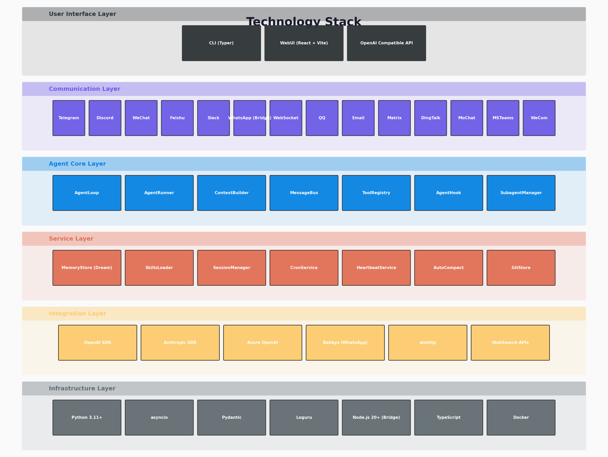

# 第3章：技术栈与开发环境

> **学习目标**：搭建完整的 nanobot 开发环境，理解其技术栈选型背后的设计考量，掌握配置系统的使用方法，并成功运行你的第一个 Agent 程序。

---

## 3.1 引言：从理论到实践的桥梁

经过前两章的学习，你已经掌握了 Agent 的核心理论：感知-思考-行动循环（PTA）、四大能力支柱（工具使用、记忆、规划、自我反思）、单 Agent 与多 Agent 架构范式。但纸上得来终觉浅——**真正理解一个系统最好的方式，就是让它在你的机器上跑起来**。

本章将带领你完成从"看懂架构图"到"亲手运行代码"的跨越。我们会：

1. **解构 nanobot 的技术栈**——理解每个依赖库的设计意图，而不仅仅是安装它们
2. **一步步搭建环境**——从 Python 安装到 LLM 配置，确保你能成功运行
3. **深入配置系统**——nanobot 的 Pydantic 配置模型是一个值得学习的工程范例
4. **运行第一个 Agent 程序**——通过 CLI 和 Python SDK 两种方式与 Agent 交互
5. **掌握调试技巧**——学会看日志、定位问题

---

## 3.2 nanobot 的技术栈全景

下图展示了 nanobot 的完整技术栈分层：



nanobot 的 `pyproject.toml` 中列出了 30+ 个直接依赖。乍一看似乎很多，但如果按功能分层梳理，你会发现它的技术栈非常清晰且克制。

### 3.2.1 核心层：Agent 引擎的基石

| 库 | 版本 | 作用 | nanobot 中的使用 |
|---|------|------|-----------------|
| **Python** | ≥3.11 | 运行时 | 利用 `asyncio.TaskGroup`（3.11+）、`typing.Self` 等新特性 |
| **Pydantic** | ≥2.12 | 数据验证与配置 | `config/schema.py` 中所有配置模型的基座 |
| **Pydantic-Settings** | ≥2.12 | 环境变量配置 | 支持 `NANOBOT_*` 前缀的环境变量自动注入 |
| **Loguru** | ≥0.7 | 日志系统 | 全项目的结构化日志，比标准库 `logging` 更简洁 |
| **asyncio** | 内置 | 异步 I/O | 整个项目的并发基础，`MessageBus`、通道、Provider 都基于它 |

**为什么选 Pydantic 2？**

Pydantic 2 相比 1.x 有巨大的性能提升（基于 Rust 核心），且提供了更灵活的验证机制。nanobot 的配置系统（`config/schema.py`，335 行）充分利用了 Pydantic 2 的以下特性：

```python
# nanobot/config/schema.py (节选)
from pydantic import AliasChoices, BaseModel, ConfigDict, Field
from pydantic.alias_generators import to_camel

class Base(BaseModel):
    """Base model that accepts both camelCase and snake_case keys."""
    model_config = ConfigDict(
        alias_generator=to_camel,    # 自动将 snake_case 转为 camelCase
        populate_by_name=True         # 允许通过原名访问
    )

class AgentDefaults(Base):
    workspace: str = "~/.nanobot/workspace"
    model: str = "anthropic/claude-opus-4-5"
    temperature: float = 0.1
    max_tool_iterations: int = 200   # 带类型安全和默认值
```

这带来三个好处：
- **类型安全**：配置值在读取时就被验证类型，`temperature="hot"` 会直接报错
- **别名兼容**：JSON 配置用 camelCase（`maxToolIterations`），Python 代码用 snake_case（`max_tool_iterations`），两者无缝映射
- **文档自洽**：Pydantic 模型本身就是活文档，每个字段的类型、默认值、约束一目了然

**为什么选 Loguru？**

标准库的 `logging` 配置繁琐，而 Loguru 的 API 极简：

```python
from loguru import logger

logger.info("Agent started")
logger.debug("Processing message: {}", message)
logger.warning("Tool {} failed: {}", tool_name, error)
```

nanobot 中所有模块都统一使用 Loguru，配合 `LOGURU_LEVEL` 环境变量即可全局控制日志级别。

### 3.2.2 LLM 层：多提供商的统一接口

| 库 | 作用 |
|---|------|
| **openai** | OpenAI 官方 SDK，同时也是大多数兼容提供商的事实标准 |
| **anthropic** | Anthropic 官方 SDK，支持 Claude 的原生特性（如 thinking blocks） |
| **tiktoken** | OpenAI 的 Token 分词器，用于估算 Prompt 长度 |
| **httpx** | 异步 HTTP 客户端，用于自定义 API 调用 |

nanobot 的设计理念是**"以 OpenAI 协议为通用标准，以原生 SDK 为特化补充"**。30+ 个 LLM 提供商中，绝大多数通过 `OpenAICompatProvider` 接入（使用 OpenAI SDK），只有少数（如 Anthropic）使用原生 SDK 以支持专有特性。

### 3.2.3 通道层：连接世界的桥梁

| 库 | 作用 | 对应通道 |
|---|------|---------|
| **python-telegram-bot** | Telegram Bot API | Telegram |
| **discord.py** | Discord API | Discord |
| **lark-oapi** | 飞书开放平台 | Feishu |
| **slack-sdk** | Slack API | Slack |
| **dingtalk-stream** | 钉钉 Stream 模式 | DingTalk |
| **qq-botpy** | QQ 频道 Bot | QQ |
| **websockets** | WebSocket 服务端/客户端 | WebSocket 通道、WebUI |
| **websocket-client** | WebSocket 客户端 | 部分通道的内部连接 |

这些依赖都是**可选通道的驱动库**。如果你只使用 CLI 模式，不需要安装任何通道依赖。

### 3.2.4 工具层：Agent 的"武器库"

| 库 | 作用 | 对应工具 |
|---|------|---------|
| **ddgs** | DuckDuckGo 搜索 | `web_search` |
| **readability-lxml** | 网页正文提取 | `web_fetch` |
| **pypdf** | PDF 解析 | 文档提取 |
| **python-docx** | Word 文档解析 | 文档提取 |
| **openpyxl** | Excel 解析 | 文档提取 |
| **python-pptx** | PPT 解析 | 文档提取 |
| **croniter** | Cron 表达式解析 | `CronService` |
| **dulwich** | 纯 Python Git 操作 | `GitStore` |

### 3.2.5 交互层：人机界面的艺术

| 库 | 作用 |
|---|------|
| **typer** | 构建优雅的 CLI（基于 Click） |
| **rich** | 终端富文本渲染（Markdown、表格、进度条） |
| **prompt-toolkit** | 交互式终端输入（历史记录、语法高亮、自动补全） |
| **questionary** | 交互式问答（配置向导中使用） |

这三者共同构建了 nanobot 极具质感的 CLI 体验：`typer` 处理命令解析，`rich` 负责输出美化，`prompt_toolkit` 负责输入体验，`questionary` 负责配置向导的问答流程。

### 3.2.6 技术栈设计哲学

nanobot 的依赖选择体现了三个原则：

1. **不重复造轮子**：用成熟的库解决边界问题（如用 `croniter` 解析 Cron、用 `dulwich` 操作 Git），把精力集中在 Agent 核心逻辑上

2. **最小化必要依赖**：30+ 个依赖中，大部分只在特定通道/功能时才需要。核心依赖（Pydantic、Loguru、asyncio）极少

3. **优先标准协议**：LLM 层以 OpenAI API 协议为通用标准，不绑定任何特定提供商

---

## 3.3 环境搭建实战

### 3.3.1 前置条件检查

首先确认你的环境满足要求：

```bash
# 检查 Python 版本（需要 ≥3.11）
python3 --version

# 检查 pip
pip3 --version

# 推荐：使用 uv 作为包管理器（更快）
# 安装 uv: curl -LsSf https://astral.sh/uv/install.sh | sh
uv --version
```

**为什么需要 Python 3.11+？**

nanobot 利用了 3.11 引入的多个重要特性：
- `asyncio.TaskGroup`：更优雅的并发任务管理
- `typing.Self`：更精确的类型注解
- 更快的 asyncio 事件循环实现
- 异常组的改进（`ExceptionGroup`）

### 3.3.2 安装 nanobot

**方式一：通过 pip 安装（推荐新手）**

```bash
pip install nanobot-ai
```

**方式二：通过 uv 安装（推荐开发者，速度更快）**

```bash
uv pip install nanobot-ai
```

**方式三：从源码安装（推荐贡献者）**

```bash
git clone https://github.com/nanobot-ai/nanobot.git
cd nanobot
pip install -e ".[dev]"    # 开发模式安装，包含测试依赖
```

### 3.3.3 运行配置向导

nanobot 提供了一个交互式配置向导，会自动创建默认配置文件：

```bash
nanobot onboard
```

向导会引导你完成：
1. **工作区目录**：默认 `~/.nanobot/`，包含配置、记忆、会话等
2. **LLM 提供商选择**：OpenAI、Anthropic、DeepSeek、Groq 等
3. **API Key 配置**：支持直接输入或环境变量引用（`${VAR_NAME}`）
4. **模型选择**：根据提供商推荐默认模型
5. **通道配置**（可选）：Telegram、Discord 等

配置完成后，`~/.nanobot/config.json` 会自动生成。

### 3.3.4 手动配置 config.json

如果你想手动编辑配置，参考以下最小可用配置：

```json
{
  "agents": {
    "defaults": {
      "model": "openai/gpt-4o",
      "workspace": "~/.nanobot/workspace"
    }
  },
  "providers": {
    "openai": {
      "apiKey": "sk-xxxxxxxxxxxxxxxxxxxxxxxx"
    }
  }
}
```

**使用环境变量（推荐生产环境）**：

```json
{
  "providers": {
    "openai": {
      "apiKey": "${OPENAI_API_KEY}"
    }
  }
}
```

然后设置环境变量：

```bash
export OPENAI_API_KEY="sk-xxxxxxxxxxxxxxxxxxxxxxxx"
```

---

## 3.4 配置系统深度解析

nanobot 的配置系统是本书中最值得学习的工程范例之一。它用 335 行 Pydantic 代码实现了**类型安全、别名兼容、环境变量覆盖、验证约束**等高级功能。

### 3.4.1 配置模型的层级结构

```
Config (根配置)
├── agents: AgentsConfig
│   └── defaults: AgentDefaults
│       ├── workspace: str              # 工作区路径
│       ├── model: str                  # 默认模型
│       ├── max_tool_iterations: int    # 最大工具迭代次数
│       ├── temperature: float          # 采样温度
│       ├── unified_session: bool       # 是否统一会话
│       └── dream: DreamConfig          # 记忆整合配置
├── channels: ChannelsConfig
│   ├── send_progress: bool             # 是否发送进度
│   └── send_max_retries: int           # 发送重试次数
├── providers: ProvidersConfig
│   ├── openai: ProviderConfig
│   ├── anthropic: ProviderConfig
│   └── ... (30+ 提供商)
├── tools: ToolsConfig
│   ├── web: WebToolsConfig             # 网络工具配置
│   ├── exec: ExecToolConfig            # Shell 执行配置
│   └── mcp_servers: list               # MCP 服务器列表
└── gateway: GatewayConfig              # 网关/WebSocket 配置
```

### 3.4.2 Pydantic 配置模型的设计亮点

**亮点 1：自动别名转换**

```python
class Base(BaseModel):
    model_config = ConfigDict(
        alias_generator=to_camel,    # snake_case → camelCase
        populate_by_name=True         # 允许用原名访问
    )
```

这意味着你的 `config.json` 可以这样写：

```json
{
  "agents": {
    "defaults": {
      "maxToolIterations": 200     // camelCase (JSON 风格)
    }
  }
}
```

而 Python 代码中可以这样访问：

```python
config.agents.defaults.max_tool_iterations  # snake_case (Python 风格)
```

**亮点 2：字段验证与约束**

```python
class DreamConfig(Base):
    interval_h: int = Field(default=2, ge=1)         # 必须 ≥1
    max_batch_size: int = Field(default=20, ge=1)    # 必须 ≥1
    max_iterations: int = Field(default=15, ge=1)    # 必须 ≥1
```

如果配置文件中写了 `"intervalH": 0`，Pydantic 会在加载时报错：

```
ValidationError: interval_h: Input should be greater than or equal to 1
```

**亮点 3：多别名支持**

```python
session_ttl_minutes: int = Field(
    default=0,
    ge=0,
    validation_alias=AliasChoices(
        "idleCompactAfterMinutes",   # 旧名称兼容
        "sessionTtlMinutes"          # 当前名称
    ),
    serialization_alias="idleCompactAfterMinutes",  # 序列化时使用
)
```

这实现了**配置格式的向后兼容**——即使字段名改了，旧配置文件依然能正常工作。

**亮点 4：环境变量自动注入**

通过 `pydantic-settings`，nanobot 支持 `NANOBOT_*` 前缀的环境变量自动覆盖配置：

```bash
# 环境变量
export NANOBOT_AGENTS__DEFAULTS__MODEL="anthropic/claude-3-5-sonnet"
export NANOBOT_PROVIDERS__OPENAI__API_KEY="sk-xxx"
```

Pydantic-Settings 会自动将这些环境变量映射到嵌套的配置字段（`__` 表示层级分隔）。

### 3.4.3 配置的加载流程

```python
# nanobot/config/loader.py (概念示意)
def load_config(config_path: Path | None) -> Config:
    if config_path and config_path.exists():
        raw = json.loads(config_path.read_text())
    else:
        raw = {}  # 使用所有默认值
    return Config.model_validate(raw)  # Pydantic 验证并转换
```

加载顺序（优先级从低到高）：

1. Pydantic 模型定义的默认值
2. `config.json` 文件中的值
3. `NANOBOT_*` 环境变量
4. 代码中显式传入的值（如 `Nanobot.from_config(workspace="/tmp")`）

---

## 3.5 第一个 Agent 程序

环境搭建完成后，我们来运行第一个 Agent 程序。nanobot 提供两种使用方式：CLI（命令行）和 Python SDK（程序化调用）。

### 3.5.1 方式一：CLI 交互模式

```bash
nanobot agent
```

你会看到类似以下的输出：

```
╭─────────────────────────────────────────╮
│  nanobot v0.1.5                         │
│  Model: openai/gpt-4o                   │
│  Workspace: ~/.nanobot/workspace        │
╰─────────────────────────────────────────╯

> 你好，请介绍一下自己
你好！我是 nanobot，一个轻量级的 AI 助手...

> 读取当前目录的 README.md
正在读取文件...
这个项目是一个...

> /exit
再见！
```

CLI 的交互体验由 `prompt_toolkit` 驱动，支持：
- **历史记录**：按 `↑`/`↓` 浏览历史输入
- **多行输入**：按 `Esc+Enter` 或 `Alt+Enter` 插入换行
- **快捷键**：`Ctrl+C` 中断生成，`Ctrl+D` 退出
- **命令**：以 `/` 开头的内置命令（如 `/status`, `/clear`, `/restart`）

### 3.5.2 方式二：Python SDK

```python
# hello_agent.py
import asyncio
from nanobot import Nanobot

async def main():
    # 从配置文件创建 Agent
    bot = Nanobot.from_config()

    # 运行一次对话
    result = await bot.run("读取 README.md 并总结项目内容")

    print(f"Agent 回复：\n{result.content}")
    print(f"使用的工具：{result.tools_used}")

if __name__ == "__main__":
    asyncio.run(main())
```

运行：

```bash
python hello_agent.py
```

**SDK 的核心设计**：

```python
# nanobot/nanobot.py (精简示意)
class Nanobot:
    @classmethod
    def from_config(cls, config_path=None, workspace=None) -> Nanobot:
        # 1. 加载配置
        config = load_config(config_path)
        # 2. 创建 Provider
        provider = _make_provider(config)
        # 3. 创建 MessageBus
        bus = MessageBus()
        # 4. 创建 AgentLoop（核心）
        loop = AgentLoop(
            bus=bus,
            provider=provider,
            workspace=config.workspace_path,
            model=config.agents.defaults.model,
            ...
        )
        return cls(loop)

    async def run(self, message: str, session_key="sdk:default") -> RunResult:
        response = await self._loop.process_direct(message, session_key=session_key)
        return RunResult(content=response.content or "", ...)
```

`Nanobot` 类是一个**门面（Facade）**——它隐藏了 `AgentLoop`、`MessageBus`、`Provider` 等复杂子系统的初始化细节，为外部用户提供极简的 API。

### 3.5.3 方式三：自定义 Hook

通过 `AgentHook` 可以扩展 Agent 的行为：

```python
from nanobot import Nanobot
from nanobot.agent.hook import AgentHook, AgentHookContext

class MyHook(AgentHook):
    async def before_iteration(self, context: AgentHookContext):
        print(f"[Hook] 第 {context.iteration} 轮迭代开始")

    async def before_execute_tools(self, context: AgentHookContext):
        for tc in context.tool_calls:
            print(f"[Hook] 即将执行工具: {tc.name}({tc.arguments})")

async def main():
    bot = Nanobot.from_config()
    result = await bot.run("搜索 Python asyncio 教程", hooks=[MyHook()])
    print(result.content)

asyncio.run(main())
```

运行后你会看到类似：

```
[Hook] 第 1 轮迭代开始
[Hook] 即将执行工具: web_search({'query': 'Python asyncio tutorial'})
[Hook] 第 2 轮迭代开始
...
```

---

## 3.6 项目结构导航

了解 nanobot 的目录结构，有助于快速定位你关心的代码：

```
nanobot/                          # Python 核心代码
├── agent/                        # Agent 核心引擎
│   ├── loop.py                   # AgentLoop: 主事件循环 (~1189行)
│   ├── runner.py                 # AgentRunner: 工具调用循环 (~1013行)
│   ├── context.py                # ContextBuilder: Prompt 构建 (~212行)
│   ├── memory.py                 # MemoryStore + Dream: 记忆系统 (~963行)
│   ├── skills.py                 # SkillsLoader: 技能加载 (~242行)
│   ├── hook.py                   # AgentHook: 生命周期钩子 (~103行)
│   ├── subagent.py               # SubagentManager: 子 Agent (~322行)
│   ├── autocompact.py            # AutoCompact: 上下文压缩
│   └── tools/                    # 内置工具集
│       ├── base.py               # Tool 抽象基类 (~279行)
│       ├── registry.py           # ToolRegistry (~125行)
│       ├── filesystem.py         # read_file/write_file/edit_file
│       ├── shell.py              # exec
│       ├── web.py                # web_search/web_fetch
│       ├── search.py             # grep/glob
│       ├── message.py            # message
│       ├── notebook.py           # notebook
│       ├── cron.py               # cron
│       ├── self.py               # my
│       ├── spawn.py              # spawn
│       └── mcp.py                # MCP 工具代理
├── bus/                          # 消息总线
│   ├── queue.py                  # MessageBus (~44行)
│   └── events.py                 # InboundMessage/OutboundMessage
├── channels/                     # 聊天通道适配器
│   ├── base.py                   # BaseChannel ABC (~197行)
│   ├── manager.py                # ChannelManager
│   ├── telegram.py               # Telegram 通道 (~52KB)
│   ├── discord.py                # Discord 通道
│   ├── websocket.py              # WebSocket 通道 (~49KB，WebUI 核心)
│   └── ...                       # 其他 10+ 个通道
├── providers/                    # LLM 提供商
│   ├── base.py                   # LLMProvider ABC (~790行)
│   ├── openai_compat.py          # OpenAI 兼容层
│   ├── anthropic.py              # Anthropic 原生 SDK
│   ├── registry.py               # ProviderSpec 注册表
│   └── transcription.py          # 语音转录
├── config/                       # 配置系统
│   ├── schema.py                 # Pydantic 配置模型 (~335行)
│   └── loader.py                 # 配置加载器
├── session/                      # 会话管理
│   └── manager.py                # SessionManager
├── cron/                         # 定时任务
│   └── service.py                # CronService
├── heartbeat/                    # 心跳服务
│   └── service.py                # HeartbeatService
├── cli/                          # 命令行界面
│   ├── commands.py               # Typer CLI (~57KB)
│   ├── onboard.py                # 配置向导 (~40KB)
│   └── stream.py                 # 流式渲染
├── api/                          # OpenAI 兼容 API
│   └── server.py                 # aiohttp 服务器
├── command/                      # 内置命令系统
│   ├── router.py                 # 命令路由
│   └── builtin.py                # 内置命令
├── skills/                       # 内置技能
│   ├── github/SKILL.md           # GitHub CLI 集成
│   ├── weather/SKILL.md          # 天气查询
│   ├── summarize/SKILL.md        # 摘要技能
│   └── ...                       # 更多技能
├── utils/                        # 通用工具
│   ├── helpers.py                # 消息构建、Token 估算
│   ├── document.py               # 文档提取
│   ├── gitstore.py               # Git 存储后端
│   └── prompt_templates.py       # Prompt 模板渲染
└── nanobot.py                    # 门面类: Nanobot (~180行)
```

**阅读建议**：如果你是第一次阅读源码，建议按以下顺序：

1. `bus/queue.py`（44 行）—— 最简单的组件，理解消息总线
2. `agent/tools/base.py`（279 行）—— 工具抽象基类
3. `agent/hook.py`（103 行）—— 生命周期钩子
4. `agent/loop.py`（前 200 行）—— 主循环入口
5. `agent/runner.py`（前 200 行）—— 执行引擎入口
6. `nanobot.py`（180 行）—— 门面类，整合所有组件

---

## 3.7 调试与日志

### 3.7.1 日志级别控制

nanobot 使用 Loguru，日志级别可以通过环境变量控制：

```bash
# 只显示 INFO 及以上级别（默认）
export LOGURU_LEVEL=INFO
nanobot agent

# 显示 DEBUG 级别（查看详细调用过程）
export LOGURU_LEVEL=DEBUG
nanobot agent

# 只显示 WARNING 及以上（安静模式）
export LOGURU_LEVEL=WARNING
nanobot agent
```

### 3.7.2 常见启动问题排查

**问题 1：`ModuleNotFoundError: No module named 'nanobot'`**

```bash
# 确认安装成功
pip list | grep nanobot

# 如果未安装
pip install nanobot-ai
```

**问题 2：`ValidationError` 配置验证失败**

```bash
# 查看详细错误信息
nanobot agent --help

# 重置配置
rm ~/.nanobot/config.json
nanobot onboard
```

**问题 3：LLM API 调用失败（401/403/429）**

```bash
# 检查 API Key 是否设置正确
echo $OPENAI_API_KEY

# 检查 config.json 中的提供商配置
cat ~/.nanobot/config.json | python -m json.tool

# 测试 API 连通性
curl https://api.openai.com/v1/models \
  -H "Authorization: Bearer $OPENAI_API_KEY"
```

**问题 4：工作区权限错误**

```bash
# 确保工作区目录可写
mkdir -p ~/.nanobot/workspace
chmod 755 ~/.nanobot
chmod 755 ~/.nanobot/workspace
```

### 3.7.3 调试技巧

**技巧 1：打印完整的 LLM 请求**

设置 `LOGURU_LEVEL=DEBUG`，nanobot 会在 DEBUG 级别输出完整的 LLM 请求和响应：

```bash
LOGURU_LEVEL=DEBUG nanobot agent 2>&1 | grep -E "(Sending request|Received response)"
```

**技巧 2：查看工具调用详情**

在 `AgentHook.before_execute_tools()` 中打印工具调用：

```python
async def before_execute_tools(self, context):
    for tc in context.tool_calls:
        logger.info(f"Tool call: {tc.name}({tc.arguments})")
```

**技巧 3：使用 Python 交互式调试**

```python
import asyncio
from nanobot import Nanobot

async def debug():
    bot = Nanobot.from_config()
    # 在这里设置断点
    import pdb; pdb.set_trace()
    result = await bot.run("测试消息")

asyncio.run(debug())
```

---

## 3.8 本章小结

本章完成了从理论到实践的过渡：

1. **技术栈全景**：nanobot 的依赖按核心层、LLM 层、通道层、工具层、交互层分层梳理。Pydantic 2 提供类型安全配置，Loguru 提供简洁日志，asyncio 提供并发基础。

2. **环境搭建**：通过 `pip install nanobot-ai` 和 `nanobot onboard` 即可完成基础配置。支持环境变量注入敏感信息，适合生产部署。

3. **配置系统**：Pydantic 模型实现了自动别名转换（snake_case/camelCase）、字段验证约束、多别名向后兼容、环境变量自动注入。335 行代码展示了工程化的配置管理范例。

4. **三种使用方式**：CLI 交互模式适合日常使用，Python SDK 适合集成到应用中，自定义 Hook 适合扩展行为。

5. **调试技巧**：通过 `LOGURU_LEVEL` 控制日志级别，通过 Hook 观察内部状态，通过 DEBUG 日志查看 LLM 通信细节。

---

## 3.9 动手实验

### 实验 1：手动创建最小配置

不运行 `nanobot onboard`，手动创建 `~/.nanobot/config.json`：

```json
{
  "agents": {
    "defaults": {
      "model": "openai/gpt-4o-mini",
      "maxToolIterations": 10,
      "temperature": 0.5
    }
  },
  "providers": {
    "openai": {
      "apiKey": "你的 API Key"
    }
  }
}
```

然后运行 `nanobot agent` 验证配置是否有效。尝试修改 `temperature` 为 `"hot"`，观察 Pydantic 的验证错误。

### 实验 2：环境变量覆盖

设置环境变量覆盖配置：

```bash
export NANOBOT_AGENTS__DEFAULTS__MAX_TOOL_ITERATIONS=5
export LOGURU_LEVEL=DEBUG
nanobot agent
```

观察 Agent 是否只执行最多 5 轮工具调用就停止。查看 DEBUG 日志中是否有配置加载的相关输出。

### 实验 3：读取项目源码

在 nanobot CLI 中，尝试以下指令：

```
> 读取 nanobot/config/schema.py 的前 50 行，告诉我这个文件的作用
> 列出 nanobot/agent/tools/ 目录下的所有文件
> 用 grep 搜索 "MessageBus" 在项目中的使用位置
```

观察 nanobot 如何组合 `read_file`、`list_dir`、`grep` 等工具来完成任务。

### 实验 4：编写自定义 Hook

创建一个文件 `my_hook.py`：

```python
from nanobot.agent.hook import AgentHook, AgentHookContext

class TokenCountHook(AgentHook):
    """统计每次对话的 Token 用量。"""

    def __init__(self):
        super().__init__()
        self.total_tokens = 0

    async def after_iteration(self, context: AgentHookContext):
        usage = context.usage
        if usage:
            tokens = usage.get("total_tokens", 0)
            self.total_tokens += tokens
            print(f"[TokenCount] 本轮使用: {tokens}, 累计: {self.total_tokens}")
```

然后修改 `hello_agent.py` 使用这个 Hook，观察 Token 用量的统计。

### 实验 5：探索工作区结构

```bash
# 查看工作区目录
ls -la ~/.nanobot/

# 查看会话文件
ls -la ~/.nanobot/workspace/sessions/

# 查看记忆文件
cat ~/.nanobot/workspace/memory/MEMORY.md 2>/dev/null || echo "MEMORY.md 尚未创建"

# 查看引导文件
ls -la ~/.nanobot/workspace/*.md
```

---

## 3.10 思考题

1. nanobot 的 `pyproject.toml` 中有 30+ 个直接依赖，但核心依赖（不安装任何通道时必需）只有几个。你能找出哪些是"核心依赖"，哪些是"可选依赖"吗？这种设计有什么好处？

2. Pydantic 的 `alias_generator=to_camel` 让 JSON 配置可以使用 camelCase，但为什么还需要 `populate_by_name=True`？如果只设置 `alias_generator` 会有什么潜在问题？

3. `Nanobot` 类被设计为**门面模式（Facade）**。如果你不使用门面，直接创建 `AgentLoop` 实例，需要手动处理哪些初始化步骤？门面模式在这里解决了什么问题？

4. `MessageBus` 只有 44 行代码，但它是整个系统的核心组件之一。这种"简单组件支撑复杂系统"的设计哲学被称为什么？你还能在 nanobot 中找到其他类似的例子吗？

5. nanobot 使用 `LOGURU_LEVEL` 环境变量控制日志级别，而不是在 `config.json` 中配置。这种设计决策背后的考量是什么？

---

## 参考阅读

- nanobot 源码：`pyproject.toml`（依赖声明，164 行）
- nanobot 源码：`nanobot/nanobot.py`（门面类，180 行）
- nanobot 源码：`nanobot/config/schema.py`（配置模型，前 150 行）
- nanobot 源码：`nanobot/config/loader.py`（配置加载器）
- nanobot 文档：`docs/configuration.md`（配置参考文档）
- Pydantic 官方文档：https://docs.pydantic.dev/
- Loguru 官方文档：https://loguru.readthedocs.io/
- Typer 官方文档：https://typer.tiangolo.com/

---

> **下一章预告**：第4章《消息总线与通道系统》将深入 nanobot 的通信核心——`MessageBus` 和 `BaseChannel`。你会理解为什么 44 行的 MessageBus 能支撑 14+ 个聊天平台，以及如何为 nanobot 添加一个新的聊天通道。
