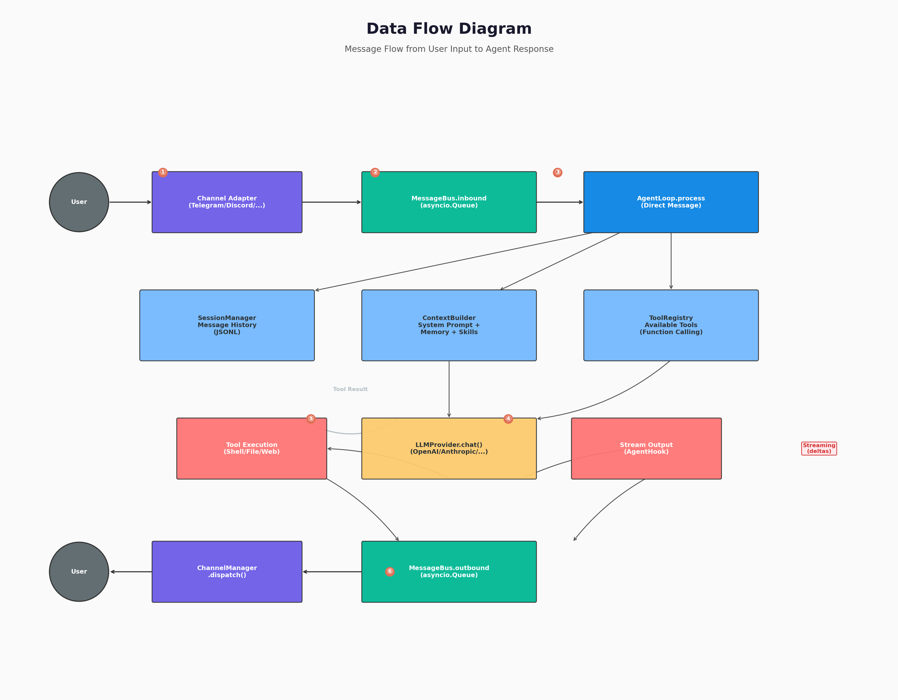

# 第5章：AgentLoop 与 AgentRunner

> **学习目标**：深入 nanobot 的心脏——理解 `AgentLoop` 如何协调消息接收、上下文构建、LLM 调用、工具执行和响应发送的完整流程；掌握 `AgentRunner` 的迭代执行机制、上下文治理策略和检查点恢复机制。

---

## 5.1 引言： AgentLoop 是 nanobot 的心脏

如果说 nanobot 是一个生命体，那么 `AgentLoop`（`agent/loop.py`，1189 行）就是它的心脏，`AgentRunner`（`agent/runner.py`，1013 行）是它的大脑皮层。前者负责**血液循环**（消息的流入流出、任务的调度分发），后者负责**思维活动**（LLM 调用、工具执行、迭代推理）。

在前面的章节中，我们已经了解了外围系统：
- `MessageBus` 负责通道与 Agent 的解耦通信
- `BaseChannel` 定义了聊天平台的接入契约
- `ToolRegistry` 管理工具的注册与执行

而本章要回答的核心问题是：

> **当一条消息从 `MessageBus.inbound` 进入系统后，到最终响应从 `MessageBus.outbound` 离开之前，究竟发生了什么？**

这个过程中涉及：会话恢复、上下文构建、LLM 调用、工具解析与执行、流式输出、错误恢复、消息持久化、检查点保存……`AgentLoop` 和 `AgentRunner` 以惊人的紧凑性完成了所有这些工作。

---

## 5.2 AgentLoop 架构总览

下图展示了消息在 nanobot 中的完整数据流：



### 5.2.1 组件组装

`AgentLoop.__init__()` 是一个典型的**依赖注入容器**。它将所有核心组件组装在一起：

```python
# nanobot/agent/loop.py (概念示意)
class AgentLoop:
    def __init__(self, bus, provider, workspace, ...):
        # 通信
        self.bus = bus                          # MessageBus
        self.provider = provider                # LLMProvider

        # 上下文与记忆
        self.context = ContextBuilder(...)      # 构建 System Prompt + Messages
        self.sessions = SessionManager(...)     # 会话持久化
        self.consolidator = Consolidator(...)   # 上下文压缩
        self.auto_compact = AutoCompact(...)    # 自动压缩过期会话
        self.dream = Dream(...)                 # 记忆整合

        # 执行
        self.tools = ToolRegistry()             # 工具注册表
        self.runner = AgentRunner(provider)     # LLM + 工具执行引擎
        self.subagents = SubagentManager(...)   # 子 Agent 管理

        # 命令系统
        self.commands = CommandRouter()
        register_builtin_commands(self.commands)

        # 并发控制
        self._concurrency_gate = asyncio.Semaphore(3)
        self._session_locks: dict[str, asyncio.Lock] = {}
        self._pending_queues: dict[str, asyncio.Queue] = {}
```

**设计亮点**：`AgentLoop` 不直接执行任何"业务逻辑"——它只负责**编排**。真正的 LLM 调用交给 `AgentRunner`，工具执行交给 `ToolRegistry`，会话管理交给 `SessionManager`。这种**单一职责**的分层让每个组件都可以独立理解和测试。

### 5.2.2 核心数据流

```
MessageBus.inbound
    │
    ▼
┌─────────────────┐
│   AgentLoop     │
│                 │
│  1. run()       │ ← 主循环：消费 inbound
│     │           │
│     ▼           │
│  2. _dispatch() │ ← 会话级串行、跨会话并发
│     │           │
│     ▼           │
│  3. _process_message() │ ← 构建上下文、处理命令
│     │           │
│     ▼           │
│  4. _run_agent_loop() │ ← 委托 AgentRunner
│     │           │
│     ▼           │
│  5. publish_outbound() │ ← 发送响应
│                 │
└─────────────────┘
```

---

## 5.3 主事件循环：run()

`AgentLoop.run()` 是整个系统中最核心的无限循环：

```python
async def run(self) -> None:
    self._running = True
    await self._connect_mcp()
    logger.info("Agent loop started")

    while self._running:
        try:
            # 1. 消费消息（超时 1 秒，用于定期检查）
            msg = await asyncio.wait_for(self.bus.consume_inbound(), timeout=1.0)
        except asyncio.TimeoutError:
            # 空闲时检查过期会话
            self.auto_compact.check_expired(...)
            continue
        except asyncio.CancelledError:
            # 优雅关闭
            if not self._running or asyncio.current_task().cancelling():
                raise
            continue
        except Exception as e:
            logger.warning("Error consuming inbound message: {}, continuing...", e)
            continue

        # 2. 优先命令（如 /stop）立即处理
        if self.commands.is_priority(raw):
            await self._dispatch_command_inline(msg, ...)
            continue

        # 3. 会话已有活跃任务？放入 pending queue（中轮注入）
        effective_key = self._effective_session_key(msg)
        if effective_key in self._pending_queues:
            self._pending_queues[effective_key].put_nowait(msg)
            continue

        # 4. 创建新任务处理消息
        task = asyncio.create_task(self._dispatch(msg))
        self._active_tasks.setdefault(effective_key, []).append(task)
```

### 5.3.1 为什么用 `asyncio.wait_for(..., timeout=1.0)`？

如果直接用 `await self.bus.consume_inbound()`，当没有消息时，`run()` 会永远挂起，无法执行任何后台任务。1 秒超时的设计让循环可以：
- **定期检查过期会话**（`auto_compact.check_expired()`）
- **响应取消信号**（`CancelledError`）
- **保持心跳**（如果未来需要）

这是一个经典的**事件循环 + 定时任务**模式。

### 5.3.2 中轮注入（Mid-turn Injection）

这是 `AgentLoop` 中一个非常精妙的设计。假设用户在与 Agent 对话时，Agent 正在执行一个耗时较长的工具（如搜索大量文件），此时用户又发了一条新消息。如果不做特殊处理：

- 方案 A：创建新任务 → 两个任务同时读写同一个会话历史 → **数据竞争**
- 方案 B：忽略新消息 → **用户体验差**
- 方案 C：等待当前任务结束 → **消息延迟**

nanobot 的方案是 **Pending Queue（中轮注入）**：

```python
# 如果会话已有活跃任务
if effective_key in self._pending_queues:
    # 将新消息放入该会话的 pending queue
    self._pending_queues[effective_key].put_nowait(msg)
    # AgentRunner 会在下一轮 LLM 调用前，将 queue 中的消息注入到对话中
```

在 `AgentRunner` 中，这些注入的消息会通过 `injection_callback` 被消费：

```python
# AgentRunner.run() 中，每轮迭代后检查注入
should_continue, injection_cycles = await self._try_drain_injections(
    spec, messages, assistant_message, injection_cycles,
    phase="after tool execution",
)
if should_continue:
    had_injections = True
    continue  # 继续下一轮迭代，注入的消息已被追加到 messages
```

**效果**：用户的新消息不会打断正在执行的工具，而是被优雅地"插队"到下一轮 LLM 调用中。Agent 看到的效果就像用户在同一条消息中追加了内容一样。

---

## 5.4 消息分发：_dispatch()

`_dispatch()` 是单条消息的"处理管家"，它负责：

### 5.4.1 会话级串行、跨会话并发

```python
async def _dispatch(self, msg: InboundMessage) -> None:
    session_key = self._effective_session_key(msg)
    lock = self._session_locks.setdefault(session_key, asyncio.Lock())
    gate = self._concurrency_gate or nullcontext()

    # 注册 pending queue，使后续消息可以中轮注入
    pending = asyncio.Queue(maxsize=20)
    self._pending_queues[session_key] = pending

    try:
        async with lock, gate:  # 串行：同一会话的消息排队处理
            # ... 实际处理逻辑 ...
    finally:
        # 清理：将 pending queue 中剩余的消息重新发布到总线
        queue = self._pending_queues.pop(session_key, None)
        if queue:
            while True:
                try:
                    item = queue.get_nowait()
                    await self.bus.publish_inbound(item)
                except asyncio.QueueEmpty:
                    break
```

**并发策略**：

| 场景 | 行为 |
|------|------|
| 不同会话的消息 | 并发处理（受 `_concurrency_gate` 限制，默认最多 3 个） |
| 同一会话的消息 | 串行处理（通过 `asyncio.Lock`） |
| 同一会话的后续消息 | 中轮注入（通过 `pending_queue`） |

这种设计确保了：
- **用户体验**：不同用户的请求互不阻塞
- **数据一致性**：同一会话的历史不会被并发修改
- **资源保护**：全局并发上限防止系统过载

### 5.4.2 流式输出的封装

如果消息标记了 `_wants_stream`（由通道在 `_handle_message()` 中设置），`_dispatch()` 会创建流式回调：

```python
if msg.metadata.get("_wants_stream"):
    stream_segment = 0

    async def on_stream(delta: str) -> None:
        meta = dict(msg.metadata or {})
        meta["_stream_delta"] = True
        meta["_stream_id"] = f"{stream_base_id}:{stream_segment}"
        await self.bus.publish_outbound(OutboundMessage(
            channel=msg.channel, chat_id=msg.chat_id,
            content=delta, metadata=meta,
        ))

    async def on_stream_end(*, resuming: bool = False) -> None:
        nonlocal stream_segment
        meta["_stream_end"] = True
        meta["_resuming"] = resuming
        await self.bus.publish_outbound(OutboundMessage(...))
        stream_segment += 1  # 进入下一个流段
```

**`resuming` 参数的含义**：
- `resuming=True`：流式输出结束，但接下来还要执行工具 → 前端应显示"思考中"的 spinner
- `resuming=False`：流式输出结束，这是最终回复 → 前端可以 finalize

---

## 5.5 消息处理：_process_message()

`_process_message()` 是单条消息的"完整加工流水线"，它的核心流程如下：

```
收到 InboundMessage
    │
    ▼
┌────────────────────────────┐
│ 1. 获取/创建 Session        │
│ 2. 恢复检查点（如果存在）    │
│ 3. 自动压缩过期会话          │
└────────────┬───────────────┘
             ▼
┌────────────────────────────┐
│ 4. 处理 / 命令              │
└────────────┬───────────────┘
             ▼
┌────────────────────────────┐
│ 5. 构建上下文（ContextBuilder）│
│    - System Prompt          │
│    - 历史消息               │
│    - 当前消息 + Runtime Context│
│    - 媒体文件（图片等）      │
└────────────┬───────────────┘
             ▼
┌────────────────────────────┐
│ 6. 提前持久化用户消息       │
│    （防止崩溃丢失）         │
└────────────┬───────────────┘
             ▼
┌────────────────────────────┐
│ 7. 调用 _run_agent_loop()   │
│    （委托 AgentRunner）     │
└────────────┬───────────────┘
             ▼
┌────────────────────────────┐
│ 8. 保存回复到 Session       │
│ 9. 清理检查点和 pending 标记 │
│ 10. 后台触发记忆整合        │
└────────────────────────────┘
```

### 5.5.1 提前持久化：防崩溃设计

一个容易被忽略但非常重要的细节：

```python
# 在调用 AgentRunner 之前，先保存用户消息
session.add_message("user", msg.content, ...)
self._mark_pending_user_turn(session)
self.sessions.save(session)
```

**为什么要在 Agent 回复之前保存用户消息？**

如果 Agent 在处理过程中崩溃（如进程被杀死、LLM API 超时），用户的消息已经安全地保存在 `session.jsonl` 中。下次启动时，`_restore_pending_user_turn()` 会发现这个标记，自动在会话历史中追加一条：

```
Error: Task interrupted before a response was generated.
```

这样用户就知道上一条消息没有被处理，可以重新发送。

### 5.5.2 Runtime Context：给 LLM 的"环境信息"

`ContextBuilder` 在构建消息时，会在用户消息前注入一段 Runtime Context：

```python
[Runtime Context — metadata only, not instructions]
Current Time: 2025-01-15 14:30:00
Channel: telegram
Chat ID: 123456
[/Runtime Context]

用户实际的消息内容...
```

这段信息被明确标记为 "metadata only, not instructions"，告诉 LLM 这只是环境信息，不是用户的指令。同时，这段 Runtime Context 在保存会话历史时会被**自动剥离**，不会污染长期记忆。

---

## 5.6 AgentRunner：迭代执行引擎

`AgentRunner.run()` 是 nanobot 最核心的算法——**工具调用循环**。它实现了 ReAct（Reasoning + Acting）范式的工程化。

### 5.6.1 迭代循环的主框架

```python
# nanobot/agent/runner.py (概念示意)
async def run(self, spec: AgentRunSpec) -> AgentRunResult:
    messages = list(spec.initial_messages)
    usage = {"prompt_tokens": 0, "completion_tokens": 0}
    empty_content_retries = 0
    length_recovery_count = 0
    injection_cycles = 0

    for iteration in range(spec.max_iterations):
        # 1. 上下文治理（压缩、截断、修复）
        messages_for_model = self._govern_context(messages, spec)

        # 2. 调用 LLM
        context = AgentHookContext(iteration=iteration, messages=messages)
        await hook.before_iteration(context)
        response = await self._request_model(spec, messages_for_model, hook, context)

        # 3. 分支：工具调用 vs 最终回复
        if response.should_execute_tools:
            # → 执行工具，将结果追加到 messages，继续循环
            results = await self._execute_tools(spec, response.tool_calls)
            messages.extend(tool_result_messages)
            continue

        # 4. 处理空回复
        if is_blank_text(clean):
            empty_content_retries += 1
            if empty_content_retries < _MAX_EMPTY_RETRIES:
                continue  # 重试
            # 超过重试次数，尝试 finalization retry
            response = await self._request_finalization_retry(spec, messages_for_model)

        # 5. 处理长度截断
        if response.finish_reason == "length":
            length_recovery_count += 1
            if length_recovery_count <= _MAX_LENGTH_RECOVERIES:
                messages.append(build_length_recovery_message())
                continue  # 让 LLM 继续生成

        # 6. 检查中轮注入
        should_continue, injection_cycles = await self._try_drain_injections(...)
        if should_continue:
            continue  # 注入了新消息，继续循环

        # 7. 最终回复
        final_content = clean
        break

    else:
        # 达到 max_iterations
        stop_reason = "max_iterations"
```

### 5.6.2 上下文治理：五层修复策略

在每次 LLM 调用前，`AgentRunner` 会对消息列表进行多层治理，确保它在 LLM 的上下文窗口范围内：

```python
messages_for_model = self._drop_orphan_tool_results(messages)      # 层1：删除孤儿工具结果
messages_for_model = self._backfill_missing_tool_results(messages_for_model)  # 层2：回填缺失结果
messages_for_model = self._microcompact(messages_for_model)        # 层3：微压缩
messages_for_model = self._apply_tool_result_budget(spec, messages_for_model)  # 层4：预算控制
messages_for_model = self._snip_history(spec, messages_for_model)  # 层5：历史截断
# 修复层1-2可能产生的新问题
messages_for_model = self._drop_orphan_tool_results(messages_for_model)
messages_for_model = self._backfill_missing_tool_results(messages_for_model)
```

| 治理层 | 方法 | 作用 |
|--------|------|------|
| 层1 | `_drop_orphan_tool_results` | 删除没有对应 `tool_calls` 的 `tool` 角色消息 |
| 层2 | `_backfill_missing_tool_results` | 为已调用但未返回结果的工具插入占位符 |
| 层3 | `_microcompact` | 压缩可压缩的工具结果（如 read_file、exec 输出） |
| 层4 | `_apply_tool_result_budget` | 控制单轮工具结果的总长度 |
| 层5 | `_snip_history` | 从历史头部截断旧消息，确保在 token 限制内 |

**为什么需要五层？**

因为每层都可能"修复"出新的问题。例如：
- 层3 压缩了一个 tool 结果 → 该消息变短了
- 层5 截断了历史头部 → 可能截掉了某个 tool_call，导致对应的 tool 结果变成"孤儿"
- 所以需要层1 再次清理

### 5.6.3 微压缩（Microcompact）

`_microcompact()` 是 nanobot 的一个精妙优化。它的核心思想是：**某些工具的结果可以被压缩而不损失语义**。

```python
_COMPACTABLE_TOOLS = frozenset({
    "read_file", "exec", "grep", "glob",
    "web_search", "web_fetch", "list_dir",
})
_MICROCOMPACT_KEEP_RECENT = 10   # 保留最近 10 条不压缩
_MICROCOMPACT_MIN_CHARS = 500    # 超过 500 字符才压缩
```

**压缩策略**：
- 保留最近的 10 条消息不压缩（这些最可能与当前任务相关）
- 对于可压缩工具的较早结果，用摘要替代完整输出
- 摘要由 LLM 在后台异步生成

**效果**：一个读取了 5000 行代码文件的 `read_file` 结果，在几轮迭代后会被压缩为"这个文件包含了 X 函数，主要做 Y 事"，释放大量上下文空间。

---

## 5.7 检查点机制：容错与恢复

### 5.7.1 为什么需要检查点？

Agent 执行一个任务可能需要多轮迭代（LLM 调用 → 工具执行 → LLM 调用 → ...）。如果在执行过程中系统崩溃或用户发送了 `/stop` 命令，已经完成的迭代工作会丢失吗？

nanobot 的答案是：**通过检查点（Checkpoint）机制，已经完成的工具执行结果会被保存到 Session 的 metadata 中，下次启动时自动恢复。**

### 5.7.2 检查点的数据结构

检查点保存在 `session.metadata["runtime_checkpoint"]` 中：

```python
{
    "phase": "awaiting_tools",           # 当前阶段
    "iteration": 2,                       # 迭代次数
    "model": "openai/gpt-4o",
    "assistant_message": {...},           # LLM 的 assistant 消息（含 tool_calls）
    "completed_tool_results": [{...}],    # 已完成的工具结果
    "pending_tool_calls": [{...}],        # 待执行的工具调用
}
```

### 5.7.3 检查点的生命周期

```
迭代开始
    │
    ▼
LLM 返回 tool_calls
    │
    ▼
保存检查点（phase="awaiting_tools", pending_tool_calls=...）
    │
    ▼
执行工具 A → 完成
    │
    ▼
更新检查点（completed_tool_results += A 的结果）
    │
    ▼
执行工具 B → 完成
    │
    ▼
更新检查点（phase="tools_completed", pending_tool_calls=[]）
    │
    ▼
下一轮 LLM 调用 → 返回最终回复
    │
    ▼
清除检查点（任务完成，无需恢复）
```

### 5.7.4 恢复逻辑

当 `_process_message()` 获取 Session 时，会调用 `_restore_runtime_checkpoint()`：

```python
def _restore_runtime_checkpoint(self, session: Session) -> bool:
    checkpoint = session.metadata.get("runtime_checkpoint")
    if not checkpoint:
        return False

    # 1. 恢复 assistant_message
    if checkpoint.get("assistant_message"):
        session.messages.append(checkpoint["assistant_message"])

    # 2. 恢复已完成的工具结果
    for result in checkpoint.get("completed_tool_results", []):
        session.messages.append(result)

    # 3. 为未完成的工具调用插入错误占位符
    for tool_call in checkpoint.get("pending_tool_calls", []):
        session.messages.append({
            "role": "tool",
            "tool_call_id": tool_call["id"],
            "content": "Error: Task interrupted before this tool finished.",
        })

    # 4. 去重：如果 session.messages 末尾已有相同消息，不重复追加
    # ...（通过 _checkpoint_message_key 比较）

    self._clear_runtime_checkpoint(session)
    return True
```

**场景示例**：

用户在 Telegram 上让 Agent 分析一个项目。Agent 执行了 `list_dir` 和 `grep`，正在执行 `read_file` 时，用户发送了 `/stop`。

- **检查点状态**：`phase="awaiting_tools"`，`completed_tool_results=[list_dir结果, grep结果]`，`pending_tool_calls=[read_file调用]`
- **恢复后**：Session 历史中追加了 assistant 消息（含 tool_calls）、list_dir 结果、grep 结果、read_file 的错误占位符
- **下次对话**：Agent 知道之前尝试过 read_file 但失败了，可以根据已有信息继续工作

---

## 5.8 _LoopHook：流式与进度的幕后推手

`_LoopHook` 是 `AgentHook` 的一个具体实现，它连接了 `AgentRunner` 的内部事件与外部世界（CLI、WebUI 等）。

### 5.8.1 think 标签剥离

一些模型（如 DeepSeek-R1、Kimi）会在回复中嵌入 `<think>...</think>` 块来展示推理过程。这些块不应该被用户看到：

```python
async def on_stream(self, context, delta: str) -> None:
    prev_clean = strip_think(self._stream_buf)      # 剥离 think 前的内容
    self._stream_buf += delta
    new_clean = strip_think(self._stream_buf)       # 剥离 think 后的内容
    incremental = new_clean[len(prev_clean):]        # 只发送新增的非 think 内容
    if incremental and self._on_stream:
        await self._on_stream(incremental)
```

**实现细节**：不是简单地从每个 delta 中删除 think 标签（这会导致标签跨越多个 delta 时处理错误），而是维护一个 `_stream_buf` 累积缓冲区，每次从累积后的完整内容中剥离 think，然后只发送**新增的非 think 内容**。

### 5.8.2 工具调用提示

当 LLM 决定调用工具时，`_LoopHook.before_execute_tools()` 会生成一个简洁的提示：

```python
async def before_execute_tools(self, context):
    tool_hint = self._loop._tool_hint(context.tool_calls)
    # 例如："read_file(path="main.py"), exec(command="ls -la")"
    await invoke_on_progress(self._on_progress, tool_hint, tool_hint=True)
```

这让用户知道 Agent 正在做什么，而不是看着屏幕发呆。

---

## 5.9 本章小结

本章深入拆解了 nanobot 的心脏——`AgentLoop` 和 `AgentRunner`：

1. **AgentLoop.run()** 是一个带 1 秒超时的无限循环，消费 `inbound` 消息并分发给 `_dispatch()`。空闲时执行后台任务（如会话过期检查）。

2. **_dispatch()** 实现了"会话级串行、跨会话并发"的调度策略，通过 `asyncio.Lock` 保证同一会话的数据一致性，通过 `Semaphore` 限制全局并发。

3. **中轮注入（Mid-turn Injection）** 通过 `pending_queue` 优雅地处理用户在 Agent 执行任务期间发送的跟进消息，避免数据竞争和用户体验问题。

4. **_process_message()** 是一条消息的完整加工流水线：获取 Session → 恢复检查点 → 构建上下文 → 提前持久化用户消息 → 委托 AgentRunner → 保存回复 → 后台记忆整合。

5. **AgentRunner.run()** 实现了 ReAct 迭代循环，核心分支是：`should_execute_tools` → 执行工具继续循环 / 最终回复结束循环。

6. **上下文治理** 采用五层修复策略（清理孤儿 → 回填缺失 → 微压缩 → 预算控制 → 历史截断），每层都可能触发后续修复，确保消息列表始终在 LLM 的上下文窗口内。

7. **检查点机制** 将执行中的状态保存到 Session metadata，支持崩溃恢复和 `/stop` 后的状态保持。恢复时已完成的结果被保留，未完成的工具调用被标记为错误。

8. **_LoopHook** 处理了流式输出的 think 标签剥离、工具调用提示、Token 用量统计等细节，连接了 AgentRunner 的内部事件与外部用户界面。

---

## 5.10 动手实验

### 实验 1：观察迭代过程

在 `nanobot/agent/runner.py` 的 `run()` 方法中添加临时日志：

```python
# 在 for iteration in range(spec.max_iterations): 循环内添加
logger.info("=== Iteration {} ===", iteration)
logger.info("Messages count: {}", len(messages))
```

然后让 nanobot 执行一个多步骤任务（如"先列出目录，然后读取最大的文件"），观察日志中的迭代次数和消息数量变化。

### 实验 2：触发检查点恢复

1. 启动 nanobot gateway 或 agent
2. 发送一条会让 Agent 执行多轮工具调用的消息
3. 在 Agent 执行工具时，发送 `/stop` 命令
4. 观察 `~/.nanobot/workspace/sessions/*.jsonl` 文件，检查是否有检查点相关的 metadata
5. 再次发送消息，观察 Agent 是否能恢复之前的状态

### 实验 3：中轮注入测试

在 nanobot CLI 中：
1. 发送一条耗时较长的任务（如"搜索并总结 Python asyncio 的最新文章"）
2. 在 Agent 还在搜索时，快速发送跟进消息"还要包括性能对比"
3. 观察 Agent 的最终回复是否包含了两条消息的意图

### 实验 4：上下文压缩观察

让 nanobot 读取一个大文件（如自身的 `loop.py`，1189 行），然后连续问几个问题。观察：
- 第一次读取时，文件内容是否完整出现在上下文中？
- 第三轮对话时，文件内容是否被压缩了？
- 在 DEBUG 日志中搜索 "microcompact" 或 "snip"，观察压缩行为

### 实验 5：流式输出调试

创建一个自定义 Hook 来观察流式输出的每个 delta：

```python
class StreamDebugHook(AgentHook):
    async def on_stream(self, context, delta: str):
        print(f"[Delta {len(delta)} chars]: {delta[:50]}...")

    async def on_stream_end(self, context, *, resuming: bool):
        print(f"[Stream End] resuming={resuming}")
```

将这个 Hook 传入 `Nanobot.run()`，观察流式输出的粒度和 `resuming` 标志的变化。

---

## 5.11 思考题

1. `AgentLoop.run()` 使用 1 秒超时而不是直接阻塞在 `consume_inbound()` 上。如果改成直接阻塞，会失去哪些功能？除了文中提到的，你还能想到什么？

2. 中轮注入的 `pending_queue` 容量设为 20。如果用户在一轮中发送了 50 条消息，会发生什么？这种设计是合理的吗？如果是你，会如何改进？

3. `_microcompact()` 保留了最近 10 条消息不压缩。这个阈值是如何影响 Agent 的行为的？如果设为 0 或 100 会有什么不同的效果？

4. 检查点恢复时，未完成的工具调用被替换为 `"Error: Task interrupted before this tool finished."`。为什么不是自动重新执行这些工具？这种设计有什么利弊？

5. `AgentRunner` 的五层上下文治理中，如果某一层抛出了异常，会进入降级模式（`except Exception: messages_for_model = messages`）。在什么情况下这种降级是安全的，什么情况下可能导致问题？

---

## 参考阅读

- nanobot 源码：`nanobot/agent/loop.py`（AgentLoop，1189 行）
- nanobot 源码：`nanobot/agent/runner.py`（AgentRunner，1013 行）
- nanobot 源码：`nanobot/agent/context.py`（ContextBuilder，212 行）
- 论文：*ReAct: Synergizing Reasoning and Acting in Language Models*（Yao et al., 2022）
- 论文：*Reflexion: Self-Reflective Agents*（Shinn et al., 2023）—— 关于 Agent 自我反思的进阶工作

---

> **下一章预告**：第6章《工具系统深度解析》将深入 `ToolRegistry` 和各类内置工具的实现。你会理解工具 Schema 的生成机制、并发执行策略、MCP 协议的集成方式，并动手实现一个带副作用监控的自定义工具。
