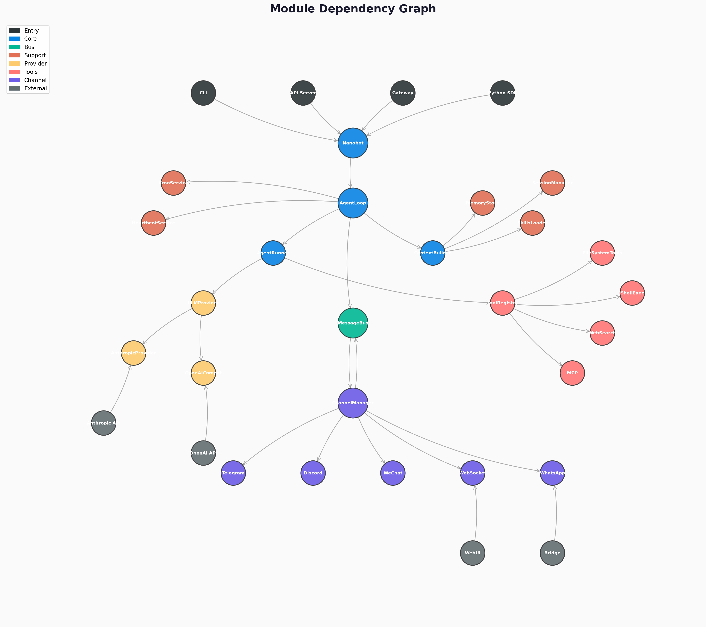

# 第10章：工程实践、测试与生态扩展

> **学习目标**：理解 nanobot 的工程化实践——测试体系、生命周期钩子、共享工具函数、CLI 启动流程、编程式 SDK、WebUI 前端架构，以及"小而美"的设计哲学。

---

## 10.1 引言：代码之外的世界

前九章我们已经深入 nanobot 的每一个角落：消息总线、Agent 循环、工具系统、Provider 抽象、记忆系统、Skills、Cron、Heartbeat、Subagent……

但一个优秀的开源项目不止有"功能代码"。它还需要：

- **测试**：确保每次修改不会破坏已有行为
- **钩子系统**：让用户无需修改源码就能定制行为
- **共享工具函数**：防御性编程的代码沉淀
- **CLI**：友好的命令行界面和启动流程
- **SDK**：让其他程序可以编程式调用
- **前端**：让非技术用户也能使用
- **设计哲学**：指导所有技术决策的价值观

本章将带你走出"功能实现"，进入"工程实践"的领域。

下图展示了 nanobot 各模块之间的依赖关系：



---

## 10.2 测试体系：活文档

nanobot 的测试代码（`tests/` 目录，137 个文件）与源码（`nanobot/` 目录）保持镜像结构：

```
tests/
├── agent/
│   ├── test_runner.py          # AgentRunner 核心测试 (~3000行)
│   ├── test_hook_composite.py  # Hook 系统测试 (381行)
│   └── ...
├── channels/
│   └── test_base_channel.py    # 通道基础测试 (37行)
├── tools/
│   └── test_filesystem_tools.py # 文件工具测试 (410行)
├── utils/
│   └── test_gitstore.py        # GitStore 测试 (216行)
├── config/
│   └── test_config_paths.py    # 配置路径测试 (49行)
└── ...
```

### 10.2.1 pytest + pytest-asyncio

```python
# pytest.ini (或 pyproject.toml)
[tool.pytest.ini_options]
asyncio_mode = "auto"
```

`asyncio_mode = "auto"` 是神来之笔——你不需要在每个异步测试上写 `@pytest.mark.asyncio`，pytest 会自动检测 `async def` 测试函数并用事件循环运行它们。

```python
# 示例：测试 SessionManager 的持久化
async def test_session_persists_across_restarts(tmp_path):
    manager1 = SessionManager(tmp_path)
    session = manager1.get_or_create("test:1")
    session.add_message("user", "hello")
    manager1.save(session, fsync=True)

    # 模拟进程重启：创建新的 SessionManager
    manager2 = SessionManager(tmp_path)
    session2 = manager2.get_or_create("test:1")

    assert len(session2.messages) == 1
    assert session2.messages[0]["content"] == "hello"
```

### 10.2.2 Fixtures：测试的基础设施

```python
@pytest.fixture
def git(tmp_path):
    """提供一个已初始化的 GitStore。"""
    store = GitStore(tmp_path, tracked_files=["SOUL.md", "USER.md"])
    store.init()
    return store

def test_git_auto_commit(git):
    """使用 git fixture 测试自动提交。"""
    (git._workspace / "SOUL.md").write_text("Hello")
    sha = git.auto_commit("Update SOUL.md")
    assert sha is not None
    assert len(sha) == 8
```

### 10.2.3 Mocking：隔离依赖

```python
from unittest.mock import AsyncMock, MagicMock, patch

async def test_agent_loop_runs_with_mocked_provider():
    provider = AsyncMock()
    provider.chat_with_retry.return_value = LLMResponse(
        content="Hello",
        tool_calls=[],
        finish_reason="stop",
    )

    bus = MessageBus()
    loop = AgentLoop(bus=bus, provider=provider, workspace=tmp_path)
    result = await loop.process_direct("hi")

    assert "Hello" in result.content
```

**关键设计**：用 `AsyncMock` 替换 LLM Provider，测试可以在毫秒级完成，而不是等待真实的 API 调用（数秒）。

### 10.2.4 参数化测试：边界全覆盖

```python
@pytest.mark.parametrize("finish_reason,expected", [
    ("stop", False),
    ("tool_calls", True),
    ("length", False),
    ("content_filter", False),
])
def test_should_execute_tools(finish_reason, expected):
    response = LLMResponse(
        content="",
        tool_calls=[ToolCallRequest(...)],
        finish_reason=finish_reason,
    )
    assert response.should_execute_tools == expected
```

### 10.2.5 回归测试：防止历史重演

nanobot 的测试中会引用具体的 GitHub Issue 编号：

```python
# 测试 #2980：防止嵌套 Git 仓库保护
def test_nested_repo_protection(tmp_path):
    # 如果 workspace 已经在某个 git 仓库内部，
    # GitStore.init() 应该拒绝创建嵌套仓库
    ...

# 测试 #3220：异常 finish_reason 不应执行工具
def test_tool_calls_under_anomalous_reason_blocked():
    ...
```

**测试即文档**：当你想知道"`finish_reason='length'` 时工具会不会执行"，与其读源码，不如先看测试——测试是行为的活文档。

---

## 10.3 Hook 系统：生命周期回调

`AgentHook`（`nanobot/agent/hook.py`，103 行）是 nanobot 的**扩展点机制**。它允许外部代码在 Agent 运行的关键节点插入自定义逻辑，而无需修改 `AgentLoop` 源码。

### 10.3.1 AgentHook 基类

```python
class AgentHook:
    def wants_streaming(self) -> bool:
        return False

    async def before_iteration(self, context: AgentHookContext) -> None:
        pass

    async def on_stream(self, context: AgentHookContext, delta: str) -> None:
        pass

    async def on_stream_end(self, context: AgentHookContext, *, resuming: bool) -> None:
        pass

    async def before_execute_tools(self, context: AgentHookContext) -> None:
        pass

    async def after_iteration(self, context: AgentHookContext) -> None:
        pass

    def finalize_content(self, context: AgentHookContext, content: str | None) -> str | None:
        return content
```

**生命周期时序**：

```
AgentRunner.run()
    │
    ├── before_iteration()     ← 每轮迭代前
    │
    ├── LLM 调用
    │   ├── on_stream(delta)   ← 每个流式 chunk（如果 wants_streaming=True）
    │   └── on_stream_end()    ← 流结束
    │
    ├── before_execute_tools() ← 执行工具前
    ├── 工具执行
    ├── after_iteration()      ← 迭代结束后
    │
    ├── (下一轮...)
    │
    └── finalize_content()     ← 最终内容格式化
```

### 10.3.2 AgentHookContext：共享状态容器

```python
@dataclass(slots=True)
class AgentHookContext:
    iteration: int
    messages: list[dict[str, Any]]
    response: LLMResponse | None = None
    usage: dict[str, int] = field(default_factory=dict)
    tool_calls: list[ToolCallRequest] = field(default_factory=list)
    tool_results: list[Any] = field(default_factory=list)
    tool_events: list[dict[str, str]] = field(default_factory=list)
    final_content: str | None = None
    stop_reason: str | None = None
    error: str | None = None
```

`slots=True` 节省内存，`@dataclass` 自动生成 `__init__`。这是 Python 3.11+ 的惯用法。

### 10.3.3 CompositeHook：错误隔离的委托器

当多个 Hook 同时存在时，`CompositeHook` 将它们组合成一个：

```python
class CompositeHook(AgentHook):
    def __init__(self, hooks: list[AgentHook]) -> None:
        self._hooks = list(hooks)

    async def _for_each_hook_safe(self, method_name: str, *args, **kwargs) -> None:
        for h in self._hooks:
            if getattr(h, "_reraise", False):
                await getattr(h, method_name)(*args, **kwargs)
                continue

            try:
                await getattr(h, method_name)(*args, **kwargs)
            except Exception:
                logger.exception("AgentHook.{} error in {}", method_name, type(h).__name__)

    def finalize_content(self, context, content):
        for h in self._hooks:
            content = h.finalize_content(context, content)
        return content
```

**两种策略**：
- **异步方法**（`before_iteration`、`on_stream` 等）：**错误隔离**。一个 Hook 崩溃不影响其他 Hook。
- **`finalize_content`**：**管道模式**。没有错误隔离——Bug 应该暴露出来，因为这是对最终内容的转换。

### 10.3.4 实战：自定义日志 Hook

```python
class LoggingHook(AgentHook):
    async def before_iteration(self, context: AgentHookContext) -> None:
        logger.info("Starting iteration {}", context.iteration)

    async def after_iteration(self, context: AgentHookContext) -> None:
        logger.info("Iteration {} done, tools used: {}",
                    context.iteration,
                    [t.name for t in context.tool_calls])

    def wants_streaming(self) -> bool:
        return True

    async def on_stream(self, context: AgentHookContext, delta: str) -> None:
        logger.debug("Stream delta ({} chars)", len(delta))

# 使用
from nanobot.nanobot import Nanobot

bot = Nanobot.from_config()
result = await bot.run("hello", hooks=[LoggingHook()])
```

---

## 10.4 工具函数层：防御性编程的代码沉淀

`nanobot/utils/helpers.py`（537 行）是整个项目的"胶水层"。它不实现任何业务逻辑，但几乎每个模块都依赖它。

### 10.4.1 strip_think：模板泄露清洗

某些模型（尤其是 Gemma 4 的 Ollama 渲染器）会输出 `<think>` 或 `<thought>` 块，甚至在流式输出中出现未闭合的标签：

```python
def strip_think(text: str) -> str:
    """Remove thinking blocks, unclosed trailing tags, and tokenizer-level template leaks."""
    # 1. 完整的 <think>...</think> 块
    text = re.sub(r"<think>[\s\S]*?</think>", "", text)
    # 2. 未闭合的 <think> 前缀（流式输出中断）
    text = re.sub(r"^\s*<think>[\s\S]*$", "", text)
    # 3. 畸形的开头标签 <think广场...（Gemma 泄露）
    text = re.sub(r"<think(?![A-Za-z0-9_\-:>/])", "", text)
    # 4. 孤立的结束标签（仅在文本开头或结尾）
    text = re.sub(r"^\s*</think>\s*", "", text)
    text = re.sub(r"\s*</think>\s*$", "", text)
    # 5. Channel 标记泄露
    text = re.sub(r"^\s*<\|?channel\|?>\s*", "", text)
    return text.strip()
```

**设计精妙之处**：
- 第3条正则使用负向前瞻 `(?![A-Za-z0-9_\-:>/])`，精确匹配 `<think` 后不是合法标签字符的情况
- 第4条只在**文本边缘**删除孤儿标签，避免误删用户正常讨论 `<think>` 的内容
- 这个函数在 `MemoryStore.append_history()` 中被调用，防止泄露污染长期记忆

### 10.4.2 find_legal_message_start：边界合法性检查

```python
def find_legal_message_start(messages: list[dict]) -> int | None:
    """Find first index where tool results have matching assistant calls."""
    # 如果第一条是 tool 结果，但前面没有对应的 tool_call → 跳过
    # 确保切片后的消息序列是 LLM API 可接受的
```

这个函数被 `Session.get_history()` 和 `retain_recent_legal_suffix()` 同时使用，确保**读取和截断**都遵守同样的规则。

### 10.4.3 Token 估算：多重降级策略

```python
def estimate_message_tokens(message: dict) -> int:
    try:
        enc = tiktoken.get_encoding("cl100k_base")
        text = json.dumps(message)
        return len(enc.encode(text))
    except Exception:
        # 降级：字符数 / 4（粗略估算，英文约 4 字符/token）
        return len(json.dumps(message)) // 4 + 4
```

**`estimate_prompt_tokens_chain()` 的三层降级**：

```
Layer 1: Provider 原生计数器（最准确，如果 Provider 支持）
    ↓ 失败
Layer 2: tiktoken（OpenAI 的 tokenizer，适用于大多数英文模型）
    ↓ 失败
Layer 3: 字符数 // 4 + 4（粗略估算，永远可用）
```

### 10.4.4 GitStore：记忆的版本控制

`GitStore`（`nanobot/utils/gitstore.py`，390 行）使用纯 Python 的 `dulwich` 库实现 Git 操作，无需依赖系统 `git` 命令：

```python
class GitStore:
    def __init__(self, workspace: Path, tracked_files: list[str]):
        self._workspace = workspace
        self._tracked_files = tracked_files

    def init(self) -> bool:
        """初始化 git 仓库（幂等）。"""
        if self.is_initialized():
            return False
        if self._is_inside_git_repo():
            # 防止嵌套仓库
            logger.warning("Workspace is inside a git repo; skipping nested init")
            return False
        porcelain.init(str(self._workspace))
        self._write_gitignore()
        self._touch_tracked_files()
        self.auto_commit("Initial commit")
        return True

    def auto_commit(self, message: str) -> str | None:
        """如果文件有变更，自动提交。"""
        if not self._is_dirty():
            return None
        # Stage tracked files → commit → return short SHA
        ...

    def line_ages(self, file_path: str) -> list[LineAge]:
        """使用 git blame 计算每行的年龄（用于 Dream 的 age annotation）。"""
        annotated = porcelain.annotate(repo, file_path)
        return _compute_line_ages(annotated)
```

**关键设计**：
- **防御性**：每个 git 操作都包裹 `try/except`，失败时返回空列表/None 而不是崩溃
- **嵌套保护**：`_is_inside_git_repo()` 向上遍历目录树，防止在已有 git 仓库内创建子仓库
- **`.gitignore` 策略**：使用反向模式 `/*` + `!tracked_files`，只跟踪记忆文件，忽略工作区其他内容

---

## 10.5 CLI 架构：Gateway 启动流程

`nanobot/cli/commands.py`（1507 行）是用户与 nanobot 交互的主要入口。它不只是一个命令解析器，更是**整个运行时系统的装配工厂**。

### 10.5.1 依赖注入全景

```python
def _run_gateway(config: Config, *, port: int | None = None):
    # Step 1: 同步工作区模板
    sync_workspace_templates(config.workspace_path)

    # Step 2: 创建核心组件
    bus = MessageBus()
    provider = _make_provider(config)
    session_manager = SessionManager(config.workspace_path)

    # Step 3: 创建 Cron 服务
    cron = CronService(config.workspace_path / "cron" / "jobs.json")

    # Step 4: 创建 AgentLoop（注入所有依赖）
    agent = AgentLoop(
        bus=bus,
        provider=provider,
        workspace=config.workspace_path,
        model=config.agents.defaults.model,
        cron_service=cron,
        session_manager=session_manager,
        ...  # 还有 10+ 个参数
    )

    # Step 5: 绑定 Cron 回调
    async def on_cron_job(job: CronJob) -> str | None:
        if job.name == "dream":
            await agent.dream.run()
            return None
        # 其他任务通过 agent.process_direct() 执行
        ...
    cron.on_job = on_cron_job

    # Step 6: 创建 ChannelManager
    channel_manager = ChannelManager(bus=bus, config=config.channels)

    # Step 7: 创建 Heartbeat
    heartbeat = HeartbeatService(
        workspace=config.workspace_path,
        provider=provider,
        model=config.agents.defaults.model,
        on_execute=...,
        on_notify=...,
    )

    # Step 8: 启动所有服务
    asyncio.run(_async_run())
```

**这不是依赖注入框架**——没有 Spring、没有 DI 容器。nanobot 使用**显式的构造函数注入**，每个组件的依赖都在创建时明确指定。简单、直接、没有魔法。

### 10.5.2 信号处理与优雅关闭

```python
import signal

def _setup_signal_handlers(agent, cron, heartbeat, channel_manager):
    def _handle_signal(signum, _frame):
        logger.info("Received signal {}, shutting down...", signum)
        # 停止所有服务
        heartbeat.stop()
        cron.stop()
        channel_manager.stop()
        # 刷盘所有 Session
        agent.sessions.flush_all()
        sys.exit(0)

    signal.signal(signal.SIGINT, _handle_signal)   # Ctrl+C
    signal.signal(signal.SIGTERM, _handle_signal)  # kill
```

**为什么需要 `flush_all()`？**

Session 默认在每次消息处理后自动保存，但如果进程在两次保存之间崩溃，最后一次消息可能丢失。`flush_all()` 在关闭前强制将所有缓存的 Session 写回磁盘（带 `fsync`），确保零数据丢失。

### 10.5.3 REPL 模式：交互式开发

```bash
$ nanobot agent
# 进入交互式对话模式
> 你好
Hello! How can I help you today?
> 帮我写一段 Python 代码
...
```

REPL 使用 `prompt_toolkit` 提供：
- **命令历史**：`~/.nanobot/.nanobot_history`
- **流式渲染**：实时显示 LLM 输出
- **异步消费**：在显示 LLM 响应的同时，后台消费 MessageBus 的 outbound 消息

```python
# REPL 核心循环（简化）
session = PromptSession(history=FileHistory(history_path))
while True:
    text = await session.prompt_async("nanobot> ")
    response = await agent.process_direct(text)
    print(response.content)
```

---

## 10.6 编程式 SDK

除了 CLI，nanobot 还提供了一个编程式接口 `Nanobot` 类（`nanobot/nanobot.py`，180 行），让其他 Python 程序可以嵌入 Agent 能力。

### 10.6.1 从配置文件创建实例

```python
from nanobot.nanobot import Nanobot

# 使用默认配置
bot = Nanobot.from_config()

# 使用指定配置
bot = Nanobot.from_config(
    config_path="~/my-project/config.json",
    workspace="~/my-project/workspace",
)
```

`_make_provider()` 工厂函数会根据配置自动创建正确的 Provider：

```python
def _make_provider(config):
    backend = spec.backend if spec else "openai_compat"
    if backend == "anthropic":
        return AnthropicProvider(...)
    elif backend == "openai_codex":
        return OpenAICodexProvider(...)
    else:
        return OpenAICompatProvider(...)
```

### 10.6.2 单次运行

```python
result = await bot.run(
    "Summarize this repo",
    session_key="sdk:my-task",
    hooks=[LoggingHook()],
)
print(result.content)
print(result.tools_used)
```

**Hook 切换的安全机制**：

```python
async def run(self, message, session_key="sdk:default", hooks=None):
    prev = self._loop._extra_hooks
    if hooks is not None:
        self._loop._extra_hooks = list(hooks)
    try:
        response = await self._loop.process_direct(message, session_key=session_key)
    finally:
        self._loop._extra_hooks = prev  # 无论是否异常，都恢复
```

使用 `try/finally` 确保即使 `process_direct()` 抛出异常，Hook 也能恢复到之前的状态。

### 10.6.3 在 Jupyter 中使用

```python
# Jupyter Notebook
import asyncio
from nanobot.nanobot import Nanobot

bot = Nanobot.from_config()
result = await bot.run("解释这段代码：def fib(n): return n if n < 2 else fib(n-1) + fib(n-2)")
print(result.content)
```

---

## 10.7 WebUI：浏览器通道

WebUI（`webui/` 目录）是 nanobot 的浏览器前端。它通过 WebSocket 与 Gateway 通信，本质上是 nanobot 的**又一个通道**——与 Telegram、WhatsApp 地位平等。

### 10.7.1 技术栈

| 层级 | 技术 | 用途 |
|------|------|------|
| 构建工具 | Vite 5 + TypeScript 5 | 快速编译、类型安全 |
| UI 框架 | React 18 | 组件化界面 |
| 样式 | Tailwind CSS 3 | 原子化 CSS |
| UI 组件 | Radix UI | 无障碍的底层组件 |
| Markdown | react-markdown + KaTeX | 消息渲染 |
| 国际化 | i18next | 9 种语言 |
| 测试 | Vitest + happy-dom | 单元测试 |

### 10.7.2 NanobotClient：WebSocket 多路复用

```typescript
// webui/src/lib/nanobot-client.ts (319 行)
class NanobotClient {
    private ws: WebSocket | null = null;
    private reconnectTimer: ReturnType<typeof setTimeout> | null = null;
    private maxBackoffMs = 30000;  // 最大重退避 30 秒

    connect(url: string) {
        this.ws = new WebSocket(url);
        this.ws.onmessage = (event) => this._handleMessage(JSON.parse(event.data));
        this.ws.onclose = () => this._scheduleReconnect();
    }

    private _scheduleReconnect() {
        const delay = Math.min(this._backoffMs, this.maxBackoffMs);
        this.reconnectTimer = setTimeout(() => this.connect(this._url), delay);
        this._backoffMs *= 2;  // 指数退避
    }
}
```

**设计亮点**：
- **指数退避重连**：网络抖动时不会疯狂重连，而是 1s → 2s → 4s → ... → 30s
- **帧队列**：断线期间的消息先排队，重连后批量发送
- **多路复用**：一个 WebSocket 连接支持多个聊天会话

### 10.7.3 乐观更新

```typescript
// webui/src/hooks/useNanobotStream.ts
function useNanobotStream(chatId: string) {
    const [messages, setMessages] = useState<Message[]>([]);

    // 乐观 UI：图片先显示本地预览，等服务器确认后再替换
    const sendImage = (file: File) => {
        const localUrl = URL.createObjectURL(file);
        setMessages(prev => [...prev, { role: "user", content: "", imageUrl: localUrl }]);
        // 异步上传...
    };
}
```

**为什么用乐观更新？**
- 图片上传可能需要数秒，用户不愿意等待
- 先显示本地预览，让用户感知到"操作已生效"
- 上传完成后再替换为服务器端 URL

### 10.7.4 懒加载 Markdown 渲染器

```typescript
// App.tsx 中预加载
useEffect(() => {
    if ("requestIdleCallback" in window) {
        requestIdleCallback(() => import("./components/MarkdownText"));
    }
}, []);

// MarkdownText.tsx
const MarkdownText = React.lazy(() => import("./MarkdownRenderer"));

// 使用
<Suspense fallback={<div>Loading...</div>}>
    <MarkdownText content={message.content} />
</Suspense>
```

`MarkdownRenderer` 是重量级组件（依赖 react-markdown、KaTeX、syntax-highlighter），通过 `React.lazy` + `requestIdleCallback` 预加载，减少首屏时间。

---

## 10.8 设计哲学：小而美的艺术

`core_agent_lines.sh` 是 nanobot 项目中最有意思的文件之一。它统计核心运行时代码量：

```bash
# core_agent_lines.sh
# Core runtime (top-level .py only)
echo "=== Core Runtime ==="
find nanobot/agent nanobot/bus nanobot/config nanobot/cron \
     nanobot/heartbeat nanobot/session \
     -maxdepth 1 -name "*.py" | xargs wc -l

# Separate buckets (recursive)
echo "=== Tools ==="
find nanobot/tools -name "*.py" | xargs wc -l

echo "=== Channels ==="
find nanobot/channels -name "*.py" | xargs wc -l
```

这个脚本本身就在传递一个信息：**nanobot 有意识地保持核心小巧**。

### 10.8.1 "小而美"的量化

| 模块 | 代码行数 | 角色 |
|------|---------|------|
| MessageBus | 44 行 | 核心解耦 |
| Hook 系统 | 103 行 | 生命周期扩展 |
| ContextBuilder | 212 行 | 提示词组装 |
| HeartbeatService | 192 行 | 定期唤醒 |
| GitStore | 390 行 | 版本控制 |
| SessionManager | 448 行 | 会话持久化 |
| CronService | 557 行 | 定时任务 |
| AgentRunner | 1013 行 | 迭代执行 |
| MemoryStore | 963 行 | 记忆系统 |
| **核心总计** | **~4000 行** | **Agent 框架核心** |

工具、通道、Provider 等外围模块各自独立，不膨胀核心。

### 10.8.2 五项设计原则

从 `CONTRIBUTING.md` 和源码中可以提炼出 nanobot 的五项设计原则：

**1. Simple：最小变化原则**

> "Prefer the smallest change that solves the real problem"

示例：`MessageBus` 只有 44 行，不需要 Kafka、RabbitMQ。对于单进程 Agent，`asyncio.Queue` 足够。

**2. Clear：为读者优化**

> "Optimize for the next reader, not for cleverness"

示例：`strip_think()` 的文档字符串长达 40 行，解释每一个正则的原因。复杂的正则不需要注释——注释比代码还长。

**3. Decoupled：保持边界清洁**

> "Keep boundaries clean and avoid unnecessary new abstractions"

示例：`AgentLoop` 不直接依赖 `TelegramChannel`，而是通过 `MessageBus` 中转。今天接 Telegram，明天接 Discord，AgentLoop 一行不改。

**4. Honest：不隐藏复杂性**

> "Do not hide complexity, but do not create extra complexity either"

示例：`LLMResponse` 的 `error_kind`、`error_type`、`error_code`、`error_should_retry` 等字段**显式暴露**了所有错误信息，而不是包装成一个模糊的 `Error` 对象。

**5. Durable：可维护、可测试、可扩展**

> "Choose solutions that are easy to maintain, test, and extend"

示例：`CompositeHook` 的错误隔离设计——你的自定义 Hook 有 bug？没关系，不会拖垮整个 Agent。

---

## 10.9 如何为 nanobot 贡献代码

### 10.9.1 双分支策略

```
main    ── 稳定分支，生产就绪
           ↑ cherry-pick
nightly ── 实验分支，新功能先在这里孵化
```

| 你的改动 | 目标分支 |
|---------|---------|
| 新功能 | `nightly` |
| Bug 修复 | `main` |
| 文档改进 | `main` |
| 重构 | `nightly` |
| 不确定 | `nightly` |

**为什么不直接 merge nightly 到 main？** cherry-pick 允许只选择稳定的特性，避免把实验性代码带入生产。

### 10.9.2 开发流程

```bash
# 1. Fork & Clone
git clone https://github.com/YOUR_NAME/nanobot.git
cd nanobot

# 2. 安装开发依赖
pip install -e ".[dev]"

# 3. 创建分支
git checkout -b my-feature nightly

# 4. 编写代码（遵循 100 字符行宽）

# 5. 运行测试
pytest

# 6. 代码检查
ruff check nanobot/
ruff format nanobot/

# 7. 提交 PR（target: nightly）
```

### 10.9.3 测试要求

每个新功能或 Bug 修复都应该伴随测试：

```python
# 好的测试：描述行为，而不是实现
def test_session_save_is_atomic(tmp_path):
    """Session save uses temp-file + replace to avoid corruption on crash."""
    ...

# 不好的测试：依赖内部实现细节
def test_session_save_calls_os_replace(tmp_path):
    """This test breaks if we switch to a different atomic strategy."""
    with patch("os.replace") as mock_replace:
        ...
```

---

## 10.10 本章小结

本章覆盖了 nanobot 的"工程基础设施"：

1. **测试体系**：pytest + pytest-asyncio，Fixture 和 Mocking 隔离依赖，参数化测试覆盖边界，回归测试引用 Issue 编号。测试是行为的活文档。

2. **Hook 系统**：`AgentHook` 提供 7 个生命周期回调点，`AgentHookContext` 共享状态，`CompositeHook` 实现错误隔离和管道化内容转换。

3. **工具函数层**：`strip_think()` 的多层模板泄露清洗、`find_legal_message_start()` 的边界合法性检查、Token 估算的三层降级、`GitStore` 的 dulwich 适配器和嵌套保护。

4. **CLI 架构**：显式依赖注入（无 DI 框架）、信号处理与优雅关闭（`flush_all()` 零数据丢失）、REPL 交互模式。

5. **编程式 SDK**：`Nanobot.from_config()` 一键创建，`run()` 支持自定义 Hook，Hook 切换使用 `try/finally` 保证恢复。

6. **WebUI**：React + Vite + Tailwind 技术栈，`NanobotClient` 的指数退避重连、帧队列和多路复用、乐观更新、懒加载 Markdown 渲染器。

7. **设计哲学**：Simple（44 行 MessageBus）、Clear（比代码长的注释）、Decoupled（Bus 解耦）、Honest（显式错误字段）、Durable（错误隔离）。

8. **贡献指南**：双分支 cherry-pick 策略、`nightly` 优先、ruff 格式化、pytest 测试。

---

## 10.11 动手实验

### 实验 1：编写自定义 Hook

```python
from nanobot.agent.hook import AgentHook, AgentHookContext
from nanobot.nanobot import Nanobot

class TokenCountingHook(AgentHook):
    def __init__(self):
        self.total_tokens = 0

    async def after_iteration(self, context: AgentHookContext) -> None:
        usage = context.usage
        tokens = usage.get("total_tokens", 0)
        self.total_tokens += tokens
        print(f"Iteration {context.iteration}: +{tokens} tokens")

    def finalize_content(self, context, content):
        print(f"Total tokens this run: {self.total_tokens}")
        return content

bot = Nanobot.from_config()
hook = TokenCountingHook()
result = await bot.run("帮我写一段快速排序", hooks=[hook])
print(result.content)
```

### 实验 2：运行测试套件

```bash
cd /path/to/nanobot
pip install -e ".[dev]"

# 运行全部测试
pytest

# 运行特定模块的测试
pytest tests/agent/test_hook_composite.py -v

# 运行带覆盖率的测试
pytest --cov=nanobot --cov-report=html
```

### 实验 3：测试 strip_think

```python
from nanobot.utils.helpers import strip_think

test_cases = [
    ("<think>内部思考</think>可见内容", "可见内容"),
    ("<think>未闭合的思考", ""),
    ("正常内容<think>中间</think>后续", "正常内容后续"),
    ("<think广场畸形标签", "广场畸形标签"),
    ("</think>孤儿结束标签", "孤儿结束标签"),
]

for input_text, expected in test_cases:
    result = strip_think(input_text)
    assert result == expected, f"Failed for: {input_text!r} => {result!r}"

print("All tests passed!")
```

### 实验 4：统计核心代码行数

```bash
cd /path/to/nanobot
bash core_agent_lines.sh
```

观察核心模块（agent/、bus/、config/、cron/、heartbeat/、session/）的代码量，与外围模块（channels/、tools/、providers/）对比。

### 实验 5：WebUI 开发模式

```bash
cd webui
npm install
npm run dev
```

浏览器访问 `http://localhost:5173`，观察 WebSocket 连接、消息收发、流式输出。

### 实验 6：在 Jupyter 中使用 SDK

```python
# Jupyter Notebook
import asyncio
from nanobot.nanobot import Nanobot

bot = Nanobot.from_config()

# 对比不同模型的回答
for model in ["gpt-4o", "claude-3-5-sonnet"]:
    result = await bot.run("解释递归", session_key=f"demo:{model}")
    print(f"=== {model} ===")
    print(result.content[:500])
    print()
```

---

## 10.12 思考题

1. `CompositeHook` 对异步方法使用错误隔离（catch + log），但对 `finalize_content` 使用管道模式（不隔离）。如果 `finalize_content` 中某个 Hook 抛出异常，整个 Agent 循环会崩溃。为什么设计者认为这种风险是可接受的？什么场景下你会想要为 `finalize_content` 也加上错误隔离？

2. `strip_think()` 的正则表达式非常细致（甚至处理了 `<think广场` 这种畸形标签）。这种防御性编程的代价是代码复杂度。在什么情况下，这种过度防御会变成"防御过度"（defensive over-engineering）？

3. Gateway 启动流程中有 8 个步骤，手动创建并组装所有组件。如果使用依赖注入框架（如 `dependency-injector` 或 `injector`），可以自动解析依赖关系。nanobot 为什么选择显式手动注入？这种"显式优于隐式"的哲学在什么规模的项目中会开始成为负担？

4. WebUI 的 `NanobotClient` 使用指数退避重连策略。如果服务器永久下线，客户端会不断重试（1s → 2s → 4s → ... → 30s → 30s → ...）。这种"永不放弃"的策略对用户体验有什么影响？你希望在什么条件下彻底停止重连？

5. nanobot 的 CONTRIBUTING.md 强调"Prefer focused patches over broad rewrites"。但在实际开发中，有时一次 broad rewrite 能消除大量技术债务。如何权衡"小步快跑"和"大刀阔斧"？

6. 本手册以 nanobot 为核心教材，系统讲解了 Agent 框架的各个方面。如果让你用这个框架开发一个实际应用（如"个人知识管理助手"或"自动化运维 Agent"），你会从哪一章的知识开始，还需要补充什么能力？

---

## 参考阅读

- nanobot 源码：`nanobot/agent/hook.py`（Hook 系统，103 行）
- nanobot 源码：`nanobot/utils/helpers.py`（工具函数，537 行）
- nanobot 源码：`nanobot/utils/gitstore.py`（Git 版本控制，390 行）
- nanobot 源码：`nanobot/cli/commands.py`（CLI 命令，1507 行）
- nanobot 源码：`nanobot/nanobot.py`（编程式 SDK，180 行）
- nanobot 源码：`nanobot/__main__.py`（模块入口，8 行）
- nanobot 源码：`webui/src/lib/nanobot-client.ts`（WebSocket 客户端，319 行）
- nanobot 源码：`core_agent_lines.sh`（代码行数统计，92 行）
- nanobot 文档：`CONTRIBUTING.md`（贡献指南）
- nanobot 文档：`COMMUNICATION.md`（社区交流）

---

> **全书结语**
>
> 从第1章的"Agent 是什么"到第10章的"如何贡献代码"，我们一起走过了 nanobot 的每一个角落。
>
> 这个项目的核心代码只有约 4000 行，但它支撑起了：多通道接入、30+ LLM Provider、工具系统、记忆管理、定时任务、心跳服务、后台子 Agent、WebUI 前端……
>
> nanobot 证明了一件事：**好的软件不需要庞大，只需要清晰**。每一个模块都有明确的边界、简洁的接口、防御性的实现。这正是"小而美"的力量。
>
> 希望你能带着这些知识，去阅读更多优秀的开源项目，去构建自己的 Agent 应用，去参与 nanobot 的社区建设。
>
> 代码之外，还有更大的世界。
